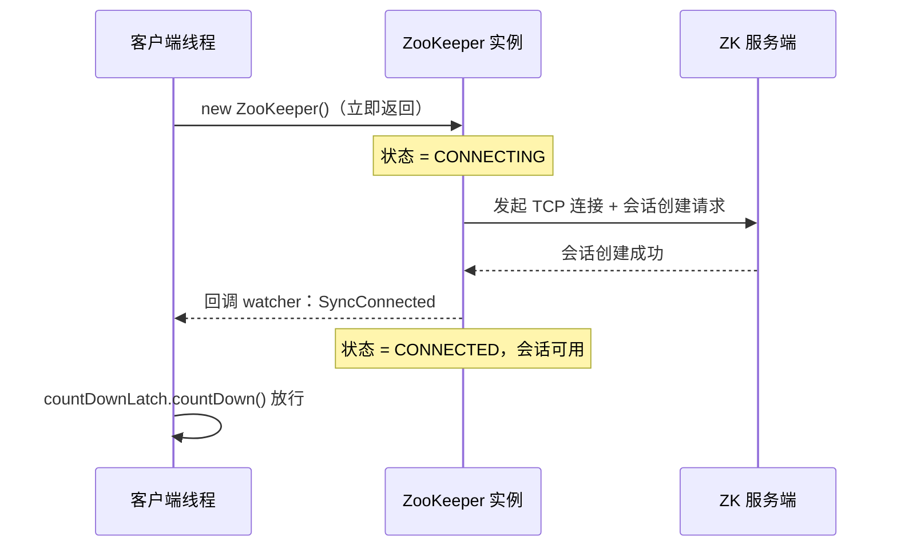
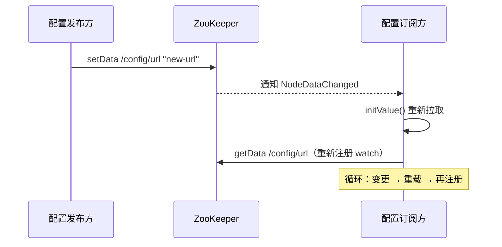

# Java客户端API详解

> 本文是 ZooKeeper 系列第 6 篇，深入 **Java 原生客户端**：连接与会话、核心 API（create/setData/getData/delete/exists）、同步/异步两种调用、ACL 参数四种方式、Watcher 注册方式、异常处理与完整配置中心案例。
> 前置知识：[02-会话与Watch机制](02-会话与Watch机制.md)、[05-ACL权限控制](05-ACL权限控制.md)
> 关联笔记：[07-Curator详解](07-Curator详解.md)（生产推荐的高级客户端）

## 版本基线

示例基于 ZooKeeper 3.6.1 客户端依赖。代码来源：原笔记（作者 2020 年实测代码），当前环境未复测——**理论标注，未在当前环境验证**。

## 受众声明

面向已了解 Session/Watch/ACL 机制的读者。假设已懂：Java、Maven、CountDownLatch。以下术语必须讲清：异步回调（AsyncCallback）、CreateMode、ConnectionLossException。

## 学习目标

学完本文你能：
1. 引入依赖并**正确建立连接**（理解建连是异步的）
2. 说清 **7 个核心 API** 及 version 参数语义（-1 无条件）
3. 用 **4 种 ACL 方式**创建节点
4. 用**同步/异步**两种风格调用 API（回调、ctx）
5. 用 **4 种方式注册 Watcher**（默认/自定义/递归/多个）
6. 处理 **ConnectionLoss 等异常**的语义
7. 独立实现一个**分布式配置中心**小案例

## 前置知识

- [02-会话与Watch机制](02-会话与Watch机制.md)——Session 与 Watch 语义
- [05-ACL权限控制](05-ACL权限控制.md)——ACL 四种模式
- 需掌握：Java 基础、Maven

---

## 目录

- [1. 依赖与连接](#1-依赖与连接)
- [2. 核心 API 总览](#2-核心-api-总览)
- [3. 创建节点](#3-创建节点)
- [4. 更新与删除](#4-更新与删除)
- [5. 读取 API](#5-读取-api)
- [6. Watcher 注册四种方式](#6-watcher-注册四种方式)
- [7. 异常处理](#7-异常处理)
- [8. 实战案例：分布式配置中心](#8-实战案例分布式配置中心)
- [9. 最佳实践](#9-最佳实践)
- [10. 常见踩坑](#10-常见踩坑)
- [11. 小结](#11-小结)

## 1. 依赖与连接

```xml
<dependency>
    <groupId>org.apache.zookeeper</groupId>
    <artifactId>zookeeper</artifactId>
    <version>3.6.1</version>
</dependency>
```

```java
ZooKeeper(String connectString, int sessionTimeout, Watcher watcher)
```

- connectString：逗号分隔的 `host:port` 列表，客户端任选一个建立连接
- sessionTimeout：会话超时时间
- watcher：接收来自 ZK 集群的事件

> 💡 **建连是异步的**：构造方法立即返回，此时会话处于 CONNECTING；服务端创建完会话后发事件通知，**收到 SyncConnected 才算真正建立**——所以要用 CountDownLatch 阻塞等待。

```java
public class ZK001 {
    private static ZooKeeper conn;
    static {
        CountDownLatch countDownLatch = new CountDownLatch(1);
        try {
            conn = new ZooKeeper("localhost:2181", 5000, new Watcher() {
                @Override
                public void process(WatchedEvent watchedEvent) {
                    if (watchedEvent.getState() == Event.KeeperState.SyncConnected) {
                        System.out.println("连接创建成功！");
                        countDownLatch.countDown();  // 无需继续阻塞
                    }
                }
            });
            countDownLatch.await();
        } catch (Exception e) {
            e.printStackTrace();
        }
        System.out.println("创建成功了，打印ID:" + conn.getSessionId());
    }
}
```

**建连时序**：



**客户端交互步骤**（规范流程）：连接并拿 SessionID → 定期心跳（否则会话过期）→ 会话活跃期内读写 znode → 完成后断开。

## 2. 核心 API 总览

| 方法 | 说明 |
|---|---|
| `create(path, data, acl, createMode)` | 创建 znode，flags 指定类型 |
| `delete(path, version)` | 版本匹配则删除 |
| `exists(path, watch)` | 判断是否存在 + 可注册 watch |
| `getData(path, watch)` | 返回数据 + 可注册 watch |
| `setData(path, data, version)` | 版本匹配则设置数据 |
| `getChildren(path, watch)` | 返回子节点名列表 + 可注册 watch |
| `sync(path)` | 把客户端连接节点的数据与 Leader 同步 |

**两条通则**：

1. **所有读取 API 都可带 watch**
2. **所有更新 API 都有两个版本**：`version=-1` 无条件更新；指定 version 为条件更新（乐观锁，见 [01-数据模型与节点详解](01-数据模型与节点详解.md)）

## 3. 创建节点

```java
// 同步
create(String path, byte[] data, List<ACL> acl, CreateMode createMode)
// 异步
create(String path, byte[] data, List<ACL> acl, CreateMode createMode,
       AsyncCallback.StringCallback callBack, Object ctx)
```

### 3.1 ACL 参数四种方式

**① 常量**：

```java
ZooDefs.Ids.OPEN_ACL_UNSAFE   // world:anyone:cdrwa（全开放）
ZooDefs.Ids.READ_ACL_UNSAFE   // world:anyone:r（只读）
ZooDefs.Ids.CREATOR_ALL_ACL   // 创建者全部权限（配合 addAuthInfo）
```

**② 自定义 List<ACL>**：

```java
List<ACL> acls = new ArrayList<>();
Id id = new Id("world", "anyone");
acls.add(new ACL(ZooDefs.Perms.READ, id));
acls.add(new ACL(ZooDefs.Perms.ADMIN, id));
```

**③ IP 授权**：

```java
Id id = new Id("ip", "127.0.0.1");
acls.add(new ACL(ZooDefs.Perms.ALL, id));
```

**④ auth/digest 授权**（先 addAuthInfo 再建节点）：

```java
zk.addAuthInfo("digest", "lub:123456".getBytes());
zk.create(path, data, ZooDefs.Ids.CREATOR_ALL_ACL, CreateMode.PERSISTENT);
```

### 3.2 CreateMode 四种节点类型

| CreateMode | 说明 |
|---|---|
| PERSISTENT | 持久节点 |
| EPHEMERAL | 临时节点（会话结束删除） |
| PERSISTENT_SEQUENTIAL | 持久有序（自动追加递增序号后缀） |
| EPHEMERAL_SEQUENTIAL | 临时有序（分布式锁核心） |

### 3.3 创建节点报错映射表

| 异常 | 原因 | 解决 |
|---|---|---|
| `NodeExistsException` | 节点已存在 | 先 exists 判断或用 `-e` 语义；或接受冲突重试 |
| `NoNodeException` | 父节点不存在 | 先创建父节点，或用 Curator `creatingParentsIfNeeded()` |
| `NoAuthException` | ACL 权限不足 | 检查 addauth 认证 |
| `InvalidACLException` | ACL 格式错误 | 检查 Id 的 scheme/id 参数 |

## 4. 更新与删除

```java
// 同步 / 异步
setData(path, data, version)                                // 同步，返回 Stat
setData(path, data, version, AsyncCallback.StatCallback cb, Object ctx)  // 异步
delete(path, version)                                       // 同步
delete(path, version, AsyncCallback.VoidCallback cb, Object ctx)        // 异步
```

- `version=-1`：不参与条件限制（无条件更新）
- 异步回调中 `rc==0` 表示成功；`ctx` 是透传的上下文参数
- 异步删除也支持 Lambda：`(rc, path, ctx) -> {...}`

**同步 vs 异步对比**：

| 维度 | 同步 | 异步 |
|---|---|---|
| 调用风格 | 直接返回结果 | 回调函数接收结果 |
| 线程阻塞 | 阻塞直到完成 | 不阻塞 |
| 适用场景 | 简单流程/学习 | 高并发、批量操作 |
| 回调参数 | — | `rc`（0=成功）/ `path` / `data` / `stat` / `ctx` |
| 易错点 | — | 回调线程执行，别在回调里阻塞 |

## 5. 读取 API

```java
// 同步：stat 传 null 表示拿最新版本数据；传入 Stat 对象则回调时填充
byte[] getData(String path, boolean watch, Stat stat)
// 异步
void getData(String path, boolean watch, DataCallback cb, Object ctx)
void getData(String path, Watcher watcher, DataCallback cb, Object ctx)
```

- `getChildren` 返回子节点名列表，可带 watch
- `exists` 返回 Stat 或 null，可带 watch（也是「探测节点是否存在」的标准方式）

## 6. Watcher 注册四种方式 ★

### 6.1 连接状态监听（构造时注册）

```java
new Watcher() {
    public void process(WatchedEvent event) {
        if (event.getType() == Event.EventType.None) {          // 连接类事件类型为 None
            if (event.getState() == KeeperState.SyncConnected)  // 连接成功
                countDownLatch.countDown();
            else if (event.getState() == KeeperState.Disconnected) // 断开
            else if (event.getState() == KeeperState.Expired)   // 会话超时（需重建会话）
            else if (event.getState() == KeeperState.AuthFailed)   // 认证失败
        }
    }
}
```

### 6.2 使用连接对象自带的 watcher

```java
zk.exists("/watcher1", true);   // true = 使用构造时注册的 watcher
// 手动创建节点 → 收到 NodeCreated；修改 → NodeDataChanged；删除 → NodeDeleted
```

### 6.3 自定义 watcher

```java
zk.exists("/watcher1", new Watcher() {
    public void process(WatchedEvent event) {
        System.out.println("自定义watcher: " + event.getPath() + " " + event.getType());
    }
});
```

### 6.4 递归注册（每次触发后重注册，实现持续监听）

```java
zk.exists("/watcher1", new Watcher() {
    public void process(WatchedEvent event) {
        // 一次性触发 → 这里重新注册自己
        try { zk.exists("/watcher1", this); } catch (Exception e) { e.printStackTrace(); }
    }
});
```

> ⚠️ 原生 watcher 一次性触发（见 [02-会话与Watch机制](02-会话与Watch机制.md)），**持续监听必须手动重注册**——这正是 Curator 封装的价值（[07-Curator详解](07-Curator详解.md)）。

**四种注册方式对比**：

| 方式 | 写法 | 适用场景 |
|---|---|---|
| 构造时默认 watcher | `new ZooKeeper(..., watcher)` | 连接状态监听 |
| 布尔 true 复用 | `exists(path, true)` | 复用默认 watcher |
| 自定义 watcher | `exists(path, new Watcher(){...})` | 每个监听独立逻辑 |
| 递归注册 | 回调里再注册自己 | 持续监听（易漏，推荐 Curator） |

## 7. 异常处理

所有同步 API 可能抛两种异常：

- **KeeperException**：服务端出错。子类 **ConnectionLossException** 表示与当前节点断开（网络分区/节点失败都会触发）——**发生时机可能在服务端处理请求之前或之后**，所以出现后必须检查之前的请求是否成功执行（客户端会自动重连）
- **InterruptedException**：方法被中断（`Thread.interrupt()` 触发）

**异常分支表**：

| 异常 | 语义 | 处理策略 |
|---|---|---|
| `ConnectionLossException` | 连接断开，请求结果未知 | **重试前先查上次请求是否成功**（幂等设计） |
| `SessionExpiredException` | 会话超时失效 | **重建 ZooKeeper 实例**（临时节点已删） |
| `NoNodeException` | 节点不存在 | 先 exists 判断或捕获处理 |
| `NodeExistsException` | 节点已存在 | 幂等创建：捕获后当成功 |
| `BadVersionException` | 版本不匹配（条件更新失败） | 重读数据重试 |
| `NoAuthException` | 无权限 | 检查 addauth 认证 |
| `InterruptedException` | 线程中断 | 恢复中断标志 |

## 8. 实战案例：分布式配置中心

思想：配置放 ZK 节点，客户端 getData 注册 watch，配置变更自动重载（**发布-订阅**）。

```java
public class ConfigCenter implements Watcher {
    CountDownLatch countDownLatch = new CountDownLatch(1);
    private ZooKeeper zk;
    private String zkIp = "localhost:2181";
    private String url, user, pwd;   // 模拟配置数据

    public ConfigCenter() throws InterruptedException, IOException, KeeperException {
        initValue();
    }

    @Override
    public void process(WatchedEvent event) {
        if (event.getState() == Event.KeeperState.SyncConnected) {
            System.out.println("连接成功！");
            countDownLatch.countDown();
        }
        // 配置变更 → 重新加载
        if (event.getType() == Event.EventType.NodeDataChanged) {
            try { initValue(); } catch (Exception e) { e.printStackTrace(); }
        }
    }

    public void initValue() throws IOException, KeeperException, InterruptedException {
        zk = new ZooKeeper(zkIp, 5000, this);   // 直接注册自身
        countDownLatch.await();
        this.url  = new String(zk.getData("/config/url",  true, null));
        this.user = new String(zk.getData("/config/user", true, null));
        this.pwd  = new String(zk.getData("/config/pwd",  true, null));
    }
    // getter/setter 省略
}
```

> 💡 案例要点：① 类实现 Watcher 直接注册自身；② getData 的 watch=true 用默认 watcher；③ 每次 NodeDataChanged 重新 initValue（又一次注册 watch = 递归注册的实战版）。生产更推荐 Curator 的 `NodeCache`（[07-Curator详解](07-Curator详解.md)）。

**配置中心发布-订阅流程**：



## 9. 最佳实践

1. 连接**统一用 CountDownLatch 等待 SyncConnected**，避免「半连接」状态下操作
2. 生产**优先用 Curator**（自动重连、重试、递归 watch），原生 API 适合学习与轻量场景
3. 写操作**带上 version** 做乐观锁；不确定版本用 -1 但要接受覆盖风险
4. 捕获 **ConnectionLossException** 后重试前先确认上次请求结果（幂等设计）
5. 会话 Expired 后**必须重建 ZooKeeper 实例**（旧会话的临时节点已删）
6. 异步回调中**只做轻量逻辑**，重操作另起线程
7. 用完 `close()` 关闭连接，避免连接泄漏（`maxClientCnxns` 超限）
8. 多节点 connectString 逗号分隔，客户端自动选可用节点

## 10. 常见踩坑

- **不等待连接就操作**：抛 ConnectionLoss/NotConnected
- **一次性 watch 忘记重注册**：丢通知（经典 bug，见 [02-会话与Watch机制](02-会话与Watch机制.md)）
- **异步调用后进程退出**：回调没执行完就结束（案例里 Thread.sleep 保证回调执行）
- **临时节点 + 会话过期**：节点被删，业务状态丢失——监控 Expired 并及时重建
- **把 ctx 当返回值**：ctx 是透传上下文，真正结果在回调参数里（rc/path/data/stat）
- **版本号用错**：条件更新必须用最近读到的 version，用 -1 会绕过校验（有覆盖风险）
- **连接不关闭**：进程结束前 close()，否则 ZK 服务端连接数堆积

## 11. 小结

1. 建连是**异步**的，用 CountDownLatch 等 SyncConnected
2. 核心 API 7 个：create/delete/exists/getData/setData/getChildren/sync；**version=-1 无条件、指定 version 乐观锁**
3. 创建节点 4 种 ACL 方式（常量/自定义/IP/auth-digest）+ 4 种 CreateMode
4. 同步/异步双风格：异步靠 AsyncCallback + ctx
5. Watcher 4 种注册方式，**持续监听要递归重注册**
6. 异常分两类：KeeperException（服务端，含 ConnectionLoss）与 InterruptedException（线程中断）
7. 配置中心案例 = getData(true) + NodeDataChanged 重载，发布-订阅的经典落地

## 下一篇

- 上一篇：[05-ACL权限控制](05-ACL权限控制.md)
- 下一篇：[07-Curator详解](07-Curator详解.md)