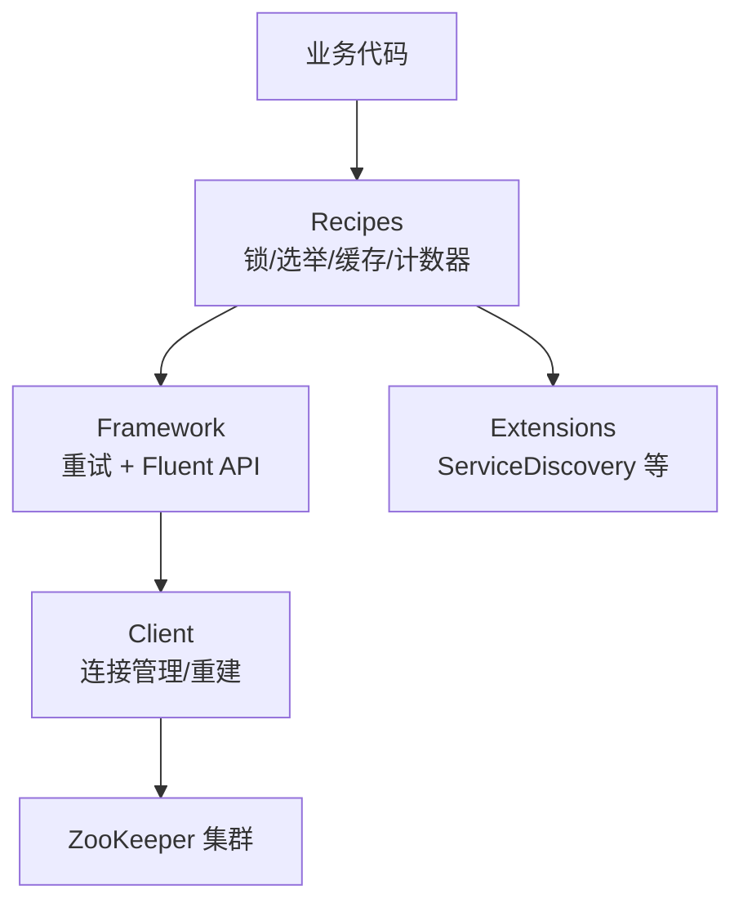
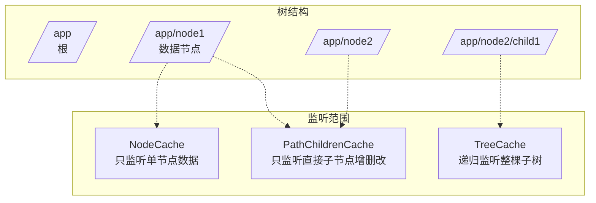
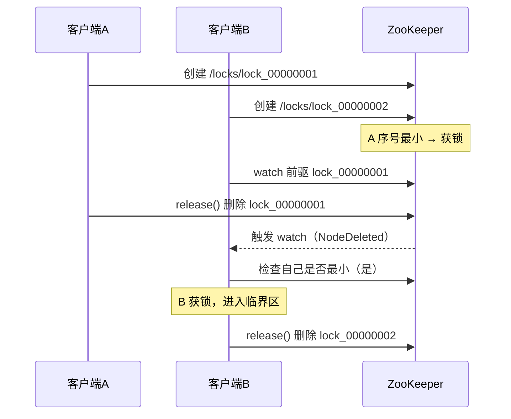

# Curator详解

> 本文是 ZooKeeper 系列第 7 篇，深入 **Apache Curator**（ZK 的 Java 高级客户端）：为什么需要它、技术栈、连接与重试、Fluent CRUD、Watcher 与缓存，以及 **Recipes 协同服务**（分布式锁/Leader 选举/服务发现）。
> 前置知识：[06-Java客户端API详解](06-Java客户端API详解.md)
> 关联笔记：[03-分布式锁原理详解](../核心原理/03-分布式锁原理详解.md)（Redis 锁对照）、[01-数据模型与节点详解](01-数据模型与节点详解.md)

## 版本基线

- Curator 4.x：支持 ZK 3.4 软兼容（需排除自带 ZK 依赖）；**Curator 5.x 要求 ZooKeeper 3.5+**
- 示例基于 Curator 4/5（Fluent API 一致）；，代码模式通用
- 当前稳定版 5.x（2026-08 查证）

## 受众声明

面向已掌握原生 API 的读者（[06-Java客户端API详解](06-Java客户端API详解.md)）。假设已懂：ZK 节点/会话/watch、Java。以下术语必须讲清：Fluent API、RetryPolicy、namespace、Recipes、InterProcessMutex。

## 学习目标

学完本文你能：
1. 说清**原生 API 的 4 个痛点**与 Curator 如何解决
2. 说出 Curator **四层技术栈**（Client/Framework/Recipes/Extensions）
3. 配置**连接参数与 4 种重试策略**
4. 用 **Fluent 风格**完成增删改查（含递归、异步、guaranteed）
5. 用 **InterProcessMutex 实现分布式锁**并讲清原理
6. 用 **Leader 选举 / 缓存 / 服务发现** 等 Recipes
7. 知道 **Curator 与 ZK 版本兼容性**选型

## 前置知识

- [06-Java客户端API详解](06-Java客户端API详解.md)——原生 API 语义
- [03-分布式锁原理详解](../核心原理/03-分布式锁原理详解.md)——锁的对比视角
- 需掌握：Java、Maven

---

## 目录

- [1. 为什么需要 Curator](#1-为什么需要-curator)
- [2. 技术栈](#2-技术栈)
- [3. 依赖与连接](#3-依赖与连接)
- [4. Fluent CRUD](#4-fluent-crud)
- [5. Watcher 与缓存](#5-watcher-与缓存)
- [6. Recipes：协同服务](#6-recipes协同服务)
- [7. 版本兼容性](#7-版本兼容性)
- [8. 最佳实践](#8-最佳实践)
- [9. 常见踩坑](#9-常见踩坑)
- [10. 小结](#10-小结)

## 1. 为什么需要 Curator

**原生 ZK API 的不足**（4 点）：

1. **连接对象异步创建**，要自己编码等待（CountDownLatch）
2. **没有自动重连/超时机制**
3. **watcher 一次注册生效一次**，持续监听要手动重注册
4. **不支持递归创建树形节点**（父节点不存在直接报错）

**Curator 的解决**：

- 自动**会话超时重连**
- **watcher 反复注册**封装
- **简化 API**（Fluent 风格链式调用）
- 提供**分布式锁、共享计数器、缓存机制**等高质量协同实现（Recipes）

**原生 vs Curator 对比**：

| 痛点 | 原生 API | Curator |
|---|---|---|
| 建连等待 | 手写 CountDownLatch | 封装，start() 即可 |
| 重连 | 无 | 自动重连 + 重试策略 |
| watch 重注册 | 手动递归 | Cache 系列自动维护 |
| 递归建树 | 不支持 | `creatingParentsIfNeeded()` |
| 分布式锁 | 手写临时有序节点逻辑 | `InterProcessMutex` 一行搞定 |

## 2. 技术栈

| 层 | 职责 |
|---|---|
| **Client** | 封装 ZooKeeper 类，管理连接，提供**重建连接机制** |
| **Framework** | 为所有 ZK 操作提供**重试机制**，对外提供 Fluent 风格 API |
| **Recipes** | 用 Framework 实现大量**协同服务**（锁/选举/缓存/计数器） |
| **Extensions** | 扩展模块（如 ServiceDiscovery） |



此图说明：依赖方向自顶向下——业务只碰 Recipes 或 Framework，Client 层透明管理底层连接。

## 3. 依赖与连接

```xml
<dependency>
  <groupId>org.apache.curator</groupId>
  <artifactId>curator-framework</artifactId>
  <version>5.x</version>
</dependency>
<dependency>
  <groupId>org.apache.curator</groupId>
  <artifactId>curator-recipes</artifactId>
  <version>5.x</version>
</dependency>
```

```java
RetryPolicy retryPolicy = new ExponentialBackoffRetry(1000, 3);
CuratorFramework client = CuratorFrameworkFactory.builder()
        .connectString("localhost:2181")        // 服务器地址列表，逗号分隔
        .sessionTimeoutMs(5000)                 // 会话超时（作用于服务端）
        .connectionTimeoutMs(5000)              // 连接超时（作用于客户端）
        .retryPolicy(retryPolicy)
        .namespace("base")                      // 命名空间：后续所有操作都在该节点下
        .build();
client.start();   // 必须 start 才能用
```

**4 种重试策略**（实现 `RetryPolicy` 接口）：

```java
new RetryOneTime(3000)                                  // 只重试 1 次，3 秒后
new RetryNTime(3, 3000)                                 // 重试 3 次，每次间隔 3 秒
new RetryUntilElapsed(10000, 3000)                      // 总等待超 10 秒停止，间隔 3 秒
new ExponentialBackoffRetry(1000, 3)                    // 指数退避（推荐）
// 间隔公式：baseSleepTimeMs * Math.max(1, random.nextInt(1 << (retryCount + 1)))
```

**重试策略对比**：

| 策略 | 行为 | 适用场景 |
|---|---|---|
| RetryOneTime | 只重试 1 次 | 简单场景 |
| RetryNTime | 固定次数、固定间隔 | 测试 |
| RetryUntilElapsed | 总时间上限 | 限时任务 |
| ExponentialBackoffRetry | 指数退避 + 随机抖动 | **生产推荐**（避免重试风暴） |

> 💡 **namespace 的作用**：设了 `/base` 后，`create().forPath("/node1")` 实际创建 `/base/node1`——多应用共用集群时天然隔离。

## 4. Fluent CRUD

### 4.1 创建

```java
client.create()
    .withMode(CreateMode.PERSISTENT)                 // 节点类型
    .withACL(ZooDefs.Ids.OPEN_ACL_UNSAFE)            // ACL
    .forPath("/node1", "node1".getBytes());          // 路径 + 数据

// 递归创建父节点（原生 API 做不到）
client.create().creatingParentsIfNeeded().forPath("/node3/node31", ...);

// 异步创建
client.create().creatingParentsIfNeeded().inBackground(new BackgroundCallback() {
    public void processResult(CuratorFramework client, CuratorEvent event) {
        System.out.println(event.getType() + " " + event.getPath());
    }
}).forPath("/node4", ...);
```

### 4.2 更新 / 删除

```java
client.setData().forPath("/node1", "node11".getBytes());   // 更新
client.setData().withVersion(-1).forPath("/node1", ...);   // 指定版本

client.delete().forPath("/node1");                         // 删除
client.delete().withVersion(-1).forPath("/node1");         // 带版本
client.delete().deletingChildrenIfNeeded().forPath("/node1"); // 递归删子节点
client.delete().guaranteed().forPath("/node1");            // 保障删除成功
client.delete().withVersion(-1).inBackground(cb).forPath("/node1"); // 异步
```

> 💡 **guaranteed**：只要客户端会话有效，就**在后台持续发删除请求直到成功**——解决「删除时网络抖动丢请求」的经典问题。

### 4.3 读取 / 检查

```java
byte[] data = client.getData().forPath("/node1");          // 读数据
Stat stat = new Stat();
byte[] data2 = client.getData().storingStatIn(stat).forPath("/node1"); // 顺带拿 stat
List<String> kids = client.getChildren().forPath("/node1"); // 子节点
Stat s = client.checkExists().forPath("/node");            // 存在性（null=不存在）
```

> ⚠️ 异步读时**返回值是 null**，数据要取 `event.getData()`（异步回调里拿）。

**Fluent 修饰符速查**：

| 修饰符 | 作用 |
|---|---|
| `creatingParentsIfNeeded()` | 递归创建父节点 |
| `deletingChildrenIfNeeded()` | 递归删除子节点 |
| `guaranteed()` | 后台持续重试直到成功 |
| `inBackground(cb)` | 异步执行 |
| `withVersion(v)` | 条件更新（乐观锁） |
| `storingStatIn(stat)` | 读取时填充 stat |

## 5. Watcher 与缓存

```java
// 一次性 watcher（Fluent）
client.getData().watched().forPath(path);
```

生产推荐用 **Cache 系列**（自动维护注册，不丢事件）：

| Cache | 监听范围 |
|---|---|
| **NodeCache** | 单个节点的数据变化 |
| **PathChildrenCache** | 直接子节点的增删改 |
| **TreeCache** | 子树全量监听（NodeCache + PathChildrenCache 合体） |

**Cache 三件套对比图**：



此图说明：NodeCache 盯单个节点、PathChildrenCache 盯直接子节点、TreeCache 盯整棵子树——按需选择，别一上来就 TreeCache（事件量大）。

**三件套适用场景**：

| Cache | 典型场景 |
|---|---|
| NodeCache | 配置中心单配置项监听 |
| PathChildrenCache | 服务实例列表（子节点=实例） |
| TreeCache | 配置中心整棵配置树、命名空间全量 |

## 6. Recipes：协同服务 ★

### 6.1 分布式锁（InterProcessMutex）

```java
InterProcessMutex lock = new InterProcessMutex(client, "/locks/lock1");
lock.acquire();        // 获取锁（可带超时：acquire(time, unit)）
try {
    // 临界区
} finally {
    lock.release();    // 必须释放
}
```

**原理**（核心考点）：

1. 所有竞争者到 `/locks/lock1` 下创建**临时有序节点**（EPHEMERAL_SEQUENTIAL）
2. **序号最小的节点获得锁**
3. 其他竞争者 **watch 前一个节点**，前一个删除（锁释放）时触发，再检查自己是否最小
4. 谁持有锁 → 会话断开自动删临时节点 → **不会死锁**（对比 Redis 锁需超时兜底）



> 对比见 [03-分布式锁原理详解](../核心原理/03-分布式锁原理详解.md)：ZK 锁无死锁风险但性能低于 Redis 锁；Redis 锁快但有锁超时/主从切换风险。

### 6.2 Leader 选举

```java
// LeaderLatch：简单选举，选上后做 Leader 工作
LeaderLatch leaderLatch = new LeaderLatch(client, "/election");
leaderLatch.start();
leaderLatch.await();        // 阻塞直到成为 Leader
boolean hasLeadership = leaderLatch.hasLeadership();

// LeaderSelector：成为 Leader 后执行任务，退出后自动参与下一轮
LeaderSelector selector = new LeaderSelector(client, "/election", new LeaderSelectorListener() {
    public void takeLeadership(CuratorFramework client) throws Exception {
        // 成为 Leader 后执行的逻辑
    }
});
selector.autoRequeue();     // 任务结束自动重新排队参与竞选
selector.start();
```

原理同样是临时顺序节点：**序号最小的节点成为 Leader**，会话断开自动让位。

**LeaderLatch vs LeaderSelector**：

| 维度 | LeaderLatch | LeaderSelector |
|---|---|---|
| 语义 | 选上就一直当 Leader | 选上执行任务，任务完自动让位 |
| 手动让位 | `close()` | 任务结束自动 |
| 重新参与 | 需重新 start | `autoRequeue()` 自动排队 |
| 适用 | 常驻 Leader（如调度主） | 轮流执行任务（如定时批处理） |

### 6.3 服务发现（ServiceDiscovery）

`curator-x-discovery` 扩展：服务注册到 `/services/<name>/<instance>`（临时节点），客户端通过 Discovery 动态获取服务实例列表——ZK 版的服务注册发现（对比 Nacos/etcd 见 [00-ZooKeeper总览](00-ZooKeeper总览.md)）。

### 6.4 其他 Recipes

共享计数器 `SharedCount` / `DistributedAtomicLong`（原子递增）、分布式队列 `DistributedQueue`、分布式屏障 `DistributedBarrier` 等——都建立在临时顺序节点 + watch 之上。

**Recipes 全家桶**：

| Recipe | 用途 | 底层 |
|---|---|---|
| InterProcessMutex | 分布式互斥锁 | 临时有序节点 + watch 前驱 |
| LeaderLatch / LeaderSelector | Leader 选举 | 临时有序节点最小序号 |
| NodeCache / PathChildrenCache / TreeCache | 监听缓存 | watch + 本地缓存 |
| SharedCount / DistributedAtomicLong | 共享计数器 | 版本号 CAS |
| DistributedQueue | 分布式队列 | 顺序节点 |
| DistributedBarrier | 分布式屏障 | 节点创建/删除同步 |
| ServiceDiscovery | 服务注册发现 | 临时节点 + JSON |

## 7. 版本兼容性

| Curator | ZooKeeper | 说明 |
|---|---|---|
| 4.2.x | 3.4.x | 软兼容模式：**必须排除 curator 自带的 ZK 依赖**，手动引 3.4 |
| 4.x / 5.x | 3.5+ | 标准支持（3.6/3.7/3.8） |
| 5.x | 3.5+ | 当前主线；**不支持 3.4** |

> 选型结论：**新项目用 Curator 5.x + ZK 3.6+**；老集群若锁死 3.4，只能用 4.2 软兼容并手动对齐 ZK 版本。

## 8. 最佳实践

1. **start() 后记得 close()**（或用 try-with-resources / 容器关闭钩子）
2. 分布式锁 **acquire 带超时**（`acquire(5, TimeUnit.SECONDS)`），避免无限阻塞
3. 监听用 **Cache 系列**，别手写递归注册 watcher
4. 多应用共用集群**设 namespace** 隔离
5. 生产锁路径约定：`/locks/<业务名>`，避免与数据节点混用
6. 重试策略选 **ExponentialBackoffRetry**（避免重试风暴），重试次数结合业务容忍度
7. 异步操作统一在回调里处理结果，回调内不做重逻辑
8. 用 `ConnectionStateListener` 监听连接状态（LOST 后重建会话）

## 9. 常见踩坑

- **忘记 client.start()**：所有操作报错
- **curator 4.2 + ZK 3.4 不排除自带依赖**：版本冲突（NoSuchMethodError 等）
- **异步回调里读返回值**：异步结果在 `CuratorEvent`，直接 return 的是 null
- **锁释放遗漏**：acquire 后必须 finally release，否则其他竞争者阻塞到会话超时
- **InterProcessMutex 重入**：同一线程可重入，但**跨线程不共享**——线程 A 加的锁线程 B 释放会抛异常
- **Cache 没 start**：NodeCache/PathChildrenCache 需要 `start()` 才开始监听
- **TreeCache 事件风暴**：子树大时事件多，性能敏感场景选 PathChildrenCache 或 NodeCache
- **锁路径与数据路径混用**：锁节点是临时的，数据节点是持久的，混用会互相干扰

## 10. 小结

1. Curator 解决原生 4 痛点：**异步建连 / 重连重试 / watcher 重注册 / 递归建树**
2. 四层栈：**Client → Framework → Recipes → Extensions**
3. Fluent API 一把梭：create/setData/delete/getData + `creatingParentsIfNeeded` / `deletingChildrenIfNeeded` / `guaranteed` / `inBackground`
4. 监听用 **NodeCache / PathChildrenCache / TreeCache**（自动维护注册）
5. Recipes 核心：**InterProcessMutex（临时有序节点+watch 前驱）、LeaderLatch/LeaderSelector、ServiceDiscovery**
6. 版本：**Curator 5.x ↔ ZK 3.5+**；4.2 才兼容 3.4（需排除依赖）

## 下一篇

- 上一篇：[06-Java客户端API详解](06-Java客户端API详解.md)
- 下一篇：[08-运维与监控专题](08-运维与监控专题.md)