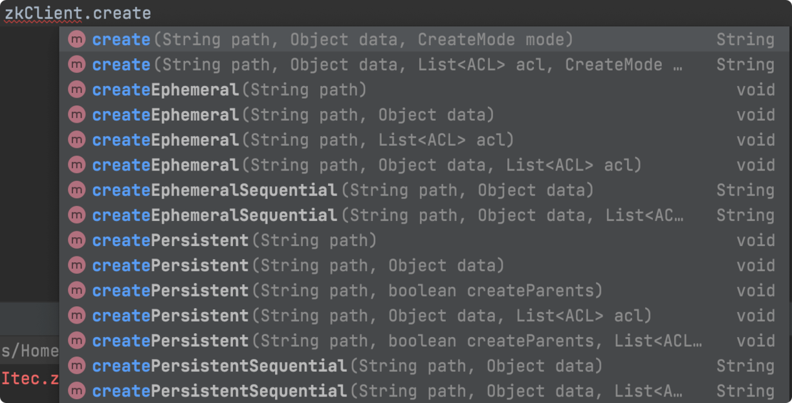
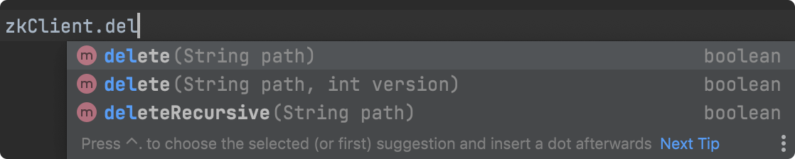
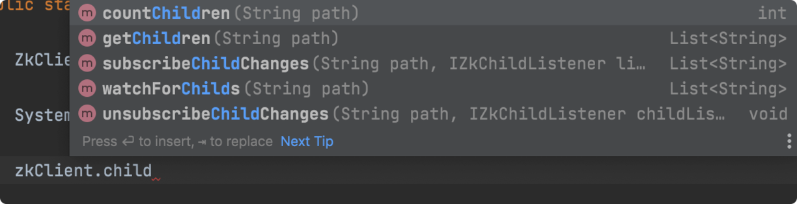
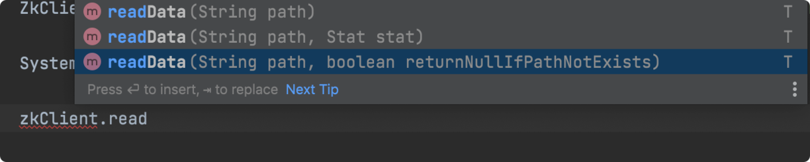
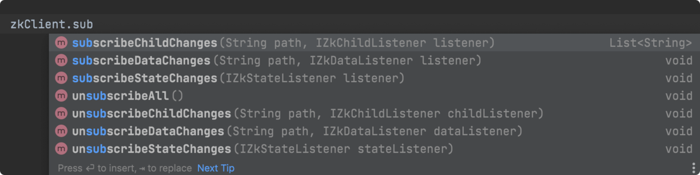

# 运维与监控专题

> 本文是 ZooKeeper 系列第 8 篇，**运维与周边生态合篇**：四字命令监控、JMX、日志清理、动态配置（reconfig）、Jute 序列化与网络协议，以及 **zkClient / Python kazoo** 两个轻量客户端。
> 前置知识：[00-ZooKeeper总览](00-ZooKeeper总览.md)（配置项）、[03-集群与Leader选举](03-集群与Leader选举.md)
> 关联笔记：[06-Java客户端API详解](06-Java客户端API详解.md)、[07-Curator详解](07-Curator详解.md)

## 版本基线

四字命令 3.4.10+ 需要白名单；动态 reconfig 为 3.5.0+ 特性；Jute 自 ZK 诞生沿用至今（兼容性原因未更换）。zkClient 0.11、kazoo 2.x。

## 受众声明

面向已掌握 ZK 核心机制的读者。假设已懂：Linux 命令、nc/telnet、JMX 基本概念。以下术语必须讲清：四字命令、reconfig、Jute、Record 接口。

## 学习目标

学完本文你能：
1. 用**四字命令**快速排查 ZK 服务状态（conf/stat/mntr/ruok 等）
2. 配置 **4lw.commands.whitelist** 白名单
3. 用 **JMX + jconsole / Prometheus** 监控 ZK
4. 用 **crontab + PurgeTxnLog** 清理日志
5. 用 **dynamic reconfig** 不停机扩缩容
6. 了解 **Jute 序列化**与 ZK **网络协议**结构
7. 会用 **zkClient** 与 **Python kazoo** 快速开发

## 前置知识

- [00-ZooKeeper总览](00-ZooKeeper总览.md)——zoo.cfg 配置项
- [03-集群与Leader选举](03-集群与Leader选举.md)——集群概念
- 需掌握：Linux 基础、nc 命令

---

## 1. 四字命令监控 ★

通过 telnet / ncat 向客户端端口（2181）发送 4 个字母的命令获取状态：

```bash
echo ruok | ncat localhost 2181    # Are you OK? 正常返回 imok
echo conf | ncat localhost 2181    # 配置信息
echo stat | ncat localhost 2181    # 服务器详情
echo dump | ncat localhost 2181    # 临时节点/未处理会话
echo wchc | ncat localhost 2181    # watch 信息（按 session 分组）
echo mntr | ncat localhost 2181    # 集群健康状态
```

> ⚠️ **白名单**：3.4.10+ 默认部分命令被禁用，报 `conf is not executed because it is not in the whitelist` 时在 zoo.cfg 加 `4lw.commands.whitelist=*` 重启（生产按需放开，不要全开）。

### 常用命令表

| 命令 | 说明 |
|---|---|
| **conf** | 服务配置详情（端口、数据/日志路径、最大连接数、Session 超时、serverId、initLimit/syncLimit 等） |
| **cons** | 所有客户端连接/会话详情（收发包数、session id、延迟、最后操作） |
| **crst** | 重置连接/会话统计 |
| **dump** | 未处理会话与临时节点 |
| **envi** | 服务器环境信息（版本、Java、OS、内存） |
| **ruok** | 健康检查，正常返回 imok |
| **stat** | 服务器详情（收发包、连接数、模式 leader/follower、节点数、延迟、客户端列表） |
| **srst** | 重置服务器状态 |
| **wchs** | watch 简洁信息（连接数、watch 节点数、watcher 数） |
| **wchc** | 按 session 分组列出 watch 节点 |
| **mntr** | 集群健康（收发包、延迟、模式、节点总数、watch 总数、临时节点总数）——**监控系统首选** |

**conf 输出要点**：`minSessionTimeout=tickTime*2`、`maxSessionTimeout=tickTime*20`；`peerType=1` 表示 Observer。

## 2. JMX 监控

ZK 原生支持 JMX：
- **jconsole**：终端执行 `jconsole` → 选 ZK 进程 → 看 MBean
- **Prometheus**：`conf` 里的 `metricsProvider` 配置 PrometheusMetricsProvider（httpPort=7000），或通过 **Exhibitor**（Netflix 的 ZK 管理工具，图形化界面 + 备份 + 监控）

## 3. 日志清理 ★

**日志类型**：数据快照（`snapshot.*`，用于数据同步）+ 事务日志（`log.*`，需定期清理）。日志增长会耗尽磁盘影响服务。

### 3.1 crontab 脚本（灵活）

```bash
#!/bin/bash
dataDir=/home/zk/zk_data/version-2
dataLogDir=/home/zk/zk_log/version-2
count=10  # 保留最新 10 条
ls -t $dataLogDir/log.* | tail -n +$count | xargs rm -f
ls -t $dataDir/snapshot.* | tail -n +$count | xargs rm -f
find $dataDir -name "snap*" -mtime +1 | xargs rm -f
find $dataLogDir -name "log.*" -mtime +1 | xargs rm -f
```

`crontab -e` 加定时任务即可。

### 3.2 PurgeTxnLog（官方工具，更稳）

```sh
java -cp "$CLASSPATH" org.apache.zookeeper.server.PurgeTxnLog
```

> 对比：crontab 灵活可自定义逻辑；PurgeTxnLog 官方实现更稳定安全。**更省心的是直接开 `autopurge.snapRetainCount` + `autopurge.purgeInterval`**（见 [00-ZooKeeper总览](00-ZooKeeper总览.md)）。

## 4. 动态配置（reconfig）★

**背景**：老方式扩缩容要停服改 `server.N` 再重启——可能覆盖已提交数据（严重）。

**dynamic reconfiguration（3.5.0+）**：不停机调整集群成员：
- 通过 `reconfig` 命令在线增删节点、改端口
- 新旧配置的法定人数（Quorum）必须可用，转换在新配置激活后完成
- 3.8.x 起配置传播更完善（即使禁用动态 reconfig 也会传播配置）

## 5. Jute 序列化与网络协议

### 5.1 Jute 序列化

ZK 没有用 Java 自带序列化，而是用 **Jute**（从 Hadoop 独立出来的序列化方案，因版本兼容沿用至今）。

- 需要传输/持久化的类实现 **Record 接口**（serialize/deserialize 方法，逻辑自己写）
- 三种序列化格式：**Binary / CSV / XML**（InputArchive/OutputArchive 接口 + 三个实现类）
- **Binary 优点**：跨平台（所有系统底层都操作二进制）

### 5.2 网络通信协议

基于 TCP/IP 之上的自有协议格式：
- **请求** = 请求头 + 请求体；**响应** = 响应头 + 响应体
- **RequestHeader**（实现 Record）：`xid`（客户端序号，记录请求发起顺序）+ `type`（操作类型）
- **请求体**按操作类型用不同类封装：会话创建 `ConnectRequest`、节点查询 `GetDataRequest` 等

## 6. zkClient（轻量客户端）

Github 开源客户端，包装原生 API 更易用，内置 **Session 超时重连、Watcher 反复注册**：

```xml
<dependency>
  <groupId>com.101tec</groupId>
  <artifactId>zkclient</artifactId>
  <version>0.11</version>
</dependency>
```

```java
ZkClient zkClient = new ZkClient("localhost:2181,localhost:2182,localhost:2183");
// 异步建连被同步化，构造完即可用

// 递归创建（原生 API 做不到）
zkClient.createPersistent("/test1/child1", true);

// 子节点变更监听（可监听不存在的节点！）
zkClient.subscribeChildChanges("/test1", new IZkChildListener() {
    public void handleChildChange(String parentPath, List<String> currentChilds) { }
});
```







> ⚠️ 现状提示：zkClient 维护已不活跃（最后版本 0.11，2017 年左右），**新项目优先 Curator**（[07-Curator详解](07-Curator详解.md)）。

## 7. Python 客户端 kazoo ★

```bash
pip install kazoo
```

### 7.1 连接与会话状态

```python
from kazoo.client import KazooClient
zk = KazooClient(hosts="127.0.0.1:2181")
zk.start()   # 服务异常会不断重试直到超时；连接/会话丢失自动重连
zk.stop()    # 显式断开
```

状态机：**lost → connected ⇄ suspended → lost**。用监听器处理状态变化：

```python
def connection_listener(state):
    if state == "LOST": ...      # 会话丢失
    elif state == "SUSPENDED": ...  # 连接中断
    else: ...                    # connected

zk.add_listener(connection_listener)
```

> ⚠️ 使用 **Lock 或临时节点时必须监听状态**——连接中断/会话丢失时锁和临时节点可能已被服务端清理。

### 7.2 节点操作

```python
zk.ensure_path("/app1/p1/p11")          # 递归创建（只设 ACL，不带数据）
zk.create("/app2", value=b"", ephemeral=False, sequence=False)  # 创建（父节点必须存在）

zk.exists("/app10")                     # 返回 ZnodeStat 或 None
zk.get("/app10")                        # (数据, ZnodeStat)
zk.get_children("/")                    # 子节点列表
zk.set("/app10", b"new")                # 更新
zk.delete("/app10")                     # 删除
```

### 7.3 监听器

```python
# 原生 watch（一次性）
def test_watch_data(event): print(event.path, event.type)
zk.get_children("/app1", watch=test_watch_data)

# 装饰器风格（kazoo 自动维护重注册）
@zk.ChildrenWatch("/app1")     # 子节点变化触发
def test1(children): print(children)

@zk.DataWatch("/app1")         # 数据变化触发
def test2(data, state): print(data, state)
```

### 7.4 事务与 ACL

```python
# 事务：原子提交多条命令（ZK 3.4+）
transaction = zk.transaction()
transaction.check("/china/p1", version=3)
transaction.create("/china/p2", b"")
results = transaction.commit()

# ACL
from kazoo import security
acl = security.make_digest_acl("reader", "123456", read=True, admin=True)
zk = KazooClient(hosts="127.0.0.1:2181", default_acl=[acl])
zk.get_acls(path="/test_node")   # 查看 ACL
```

## 最佳实践

1. **监控标配**：`mntr`（四字命令）+ JMX/Prometheus 双通道，告警指标看 Mode/节点数/延迟/连接数
2. 四字命令**白名单按需放开**（只开 conf/stat/mntr/ruok），不要 `*` 全开
3. 日志清理优先 **autopurge**，脚本兜底；清理前先备份
4. 集群扩缩容用 **reconfig**，别停服改配置（防数据覆盖）
5. Python 场景用 kazoo（带重连/状态监听），Java 场景用 Curator，**zkClient 不推荐新项目**

## 常见踩坑

- **四字命令被拒**：白名单未配置 → `4lw.commands.whitelist`
- **nc 未安装**：macOS/Linux 用 `ncat` 或 `telnet`
- **PurgeTxnLog 手滑删快照**：脚本保留数 `count` 别设 0，快照是数据同步的基础
- **reconfig 后集群不可用**：新旧 Quorum 必须可用，先加节点再删节点
- **kazoo 临时节点锁丢**：没监听状态，会话 LOST 后锁悄悄消失

## 小结

1. 四字命令 = ZK 的"体检表"：**ruok 探活、stat/mntr 看状态、dump 看临时节点**，别忘白名单
2. 日志清理三选一：**autopurge（推荐）/ PurgeTxnLog（官方）/ crontab（灵活）**
3. **reconfig（3.5+）** 实现不停机扩缩容
4. Jute 序列化（Binary/CSV/XML）+ 自有 TCP 协议（RequestHeader: xid+type）
5. 轻量客户端：zkClient（Java，维护停滞）与 kazoo（Python，状态监听 + 装饰器 watch）

## 下一篇

- 上一篇：[07-Curator详解](07-Curator详解.md)
- 下一篇：[09-应用场景与分布式协同](09-应用场景与分布式协同.md)

---
*创建于 2026-08-09（wolai 笔记转存 + 网络查证补充）*
