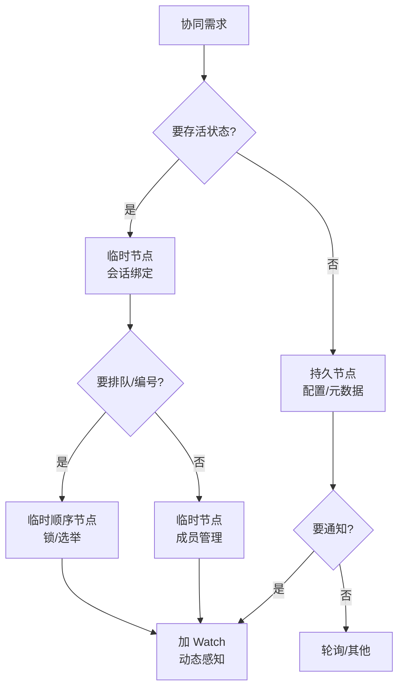
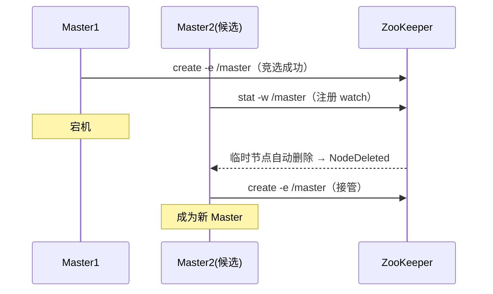
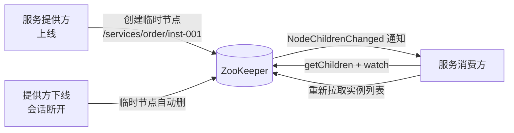
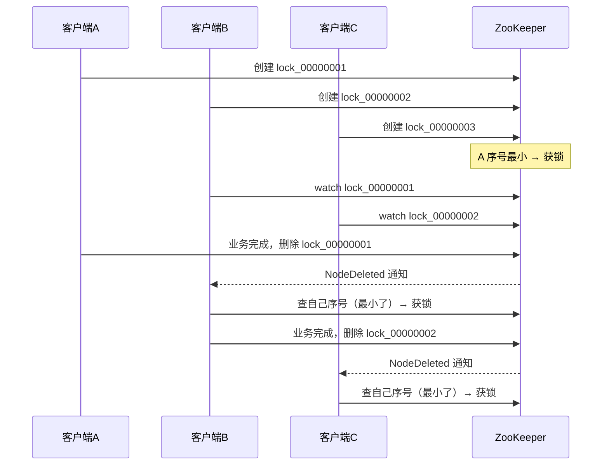
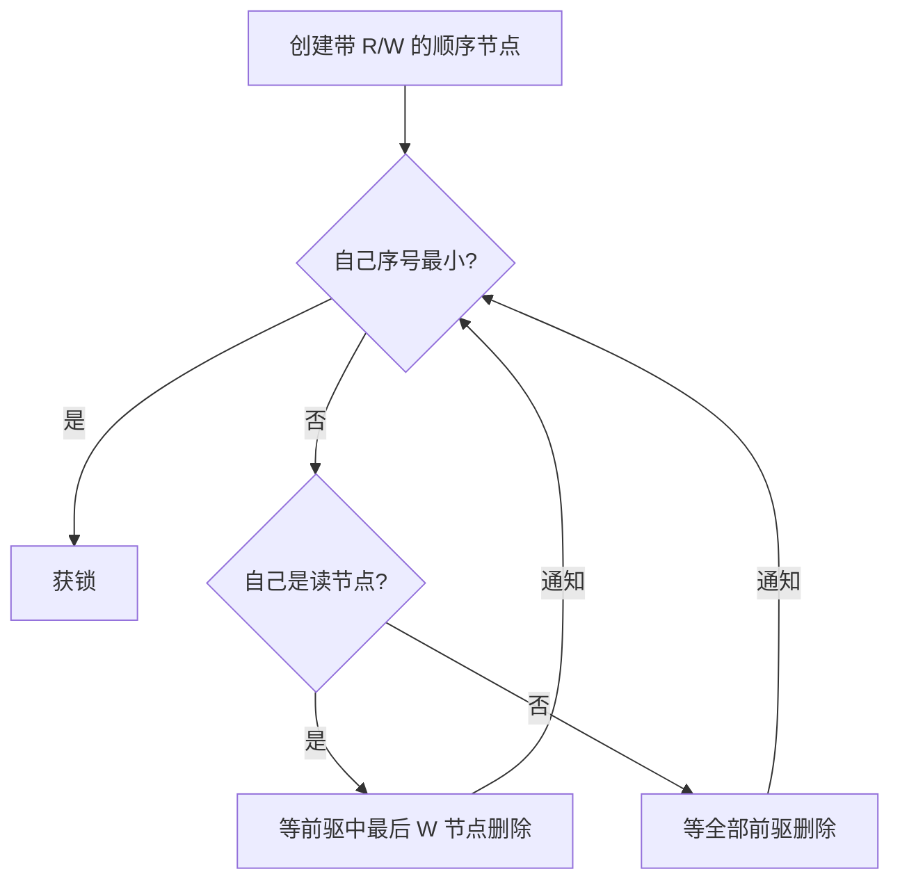
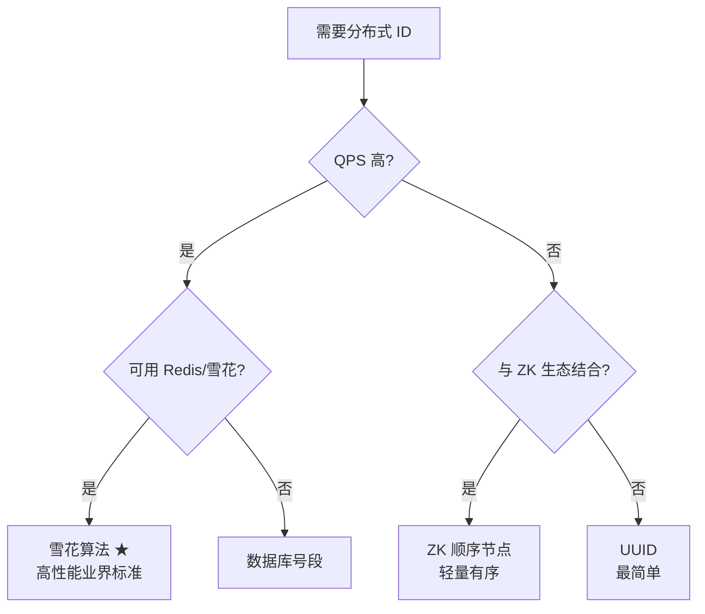
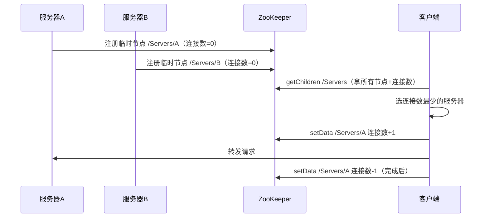

# 应用场景与分布式协同

> 本文是 ZooKeeper 系列第 9 篇，**场景实战篇**：Master 选举、数据发布/订阅与服务发现、分布式锁（排他/共享）、分布式 ID 生成器、负载均衡——全是「临时节点 + Watch + 顺序节点」三板斧的组合应用。
> 前置知识：[01-数据模型与节点详解](01-数据模型与节点详解.md)、[02-会话与Watch机制](02-会话与Watch机制.md)
> 关联笔记：[03-分布式锁原理详解](../03-分布式锁原理详解.md)（Redis 锁对照）、[06-负载均衡详解](../06-负载均衡详解.md)、[07-Curator详解](07-Curator详解.md)

## 版本基线

场景机制全版本通用（临时节点 + watch + 顺序节点）。示例命令基于 zkCli 3.6+；curator-x-discovery 需要 Curator 4/5。

## 受众声明

面向已掌握 znode/Session/Watch 三大机制的读者。假设已懂：分布式锁概念、负载均衡基本概念。以下术语必须讲清：排他锁、共享锁、临时顺序节点。

## 学习目标

学完本文你能：
1. 用**临时节点 + watch** 实现 **Master 选举**与 worker 监控
2. 说清**服务发现**三要素与 curator-x-discovery 的设计
3. 讲清 **ZK 排他锁/共享锁**的实现细节与释放方式
4. 对比 **5 种分布式 ID 生成策略**，知道 ZK 顺序节点方案
5. 用 **ZK 做负载均衡**（状态收集 + 最小连接数算法）
6. 理解所有场景背后的**三板斧模式**（临时节点/顺序节点/Watch）

## 前置知识

- [01-数据模型与节点详解](01-数据模型与节点详解.md)——节点类型
- [02-会话与Watch机制](02-会话与Watch机制.md)——watch 与临时节点生命周期
- 需掌握：分布式锁、负载均衡基本概念

---

## 目录

- [1. 三板斧模式](#1-三板斧模式)
- [2. Master 选举（Master-Worker 协同）](#2-master-选举master-worker-协同)
- [3. 数据发布/订阅与服务发现](#3-数据发布订阅与服务发现)
- [4. 分布式锁](#4-分布式锁)
- [5. 分布式 ID 生成器](#5-分布式-id-生成器)
- [6. 负载均衡](#6-负载均衡)
- [7. 最佳实践](#7-最佳实践)
- [8. 常见踩坑](#8-常见踩坑)
- [9. 小结](#9-小结)

## 1. 三板斧模式

**一句话记忆**：所有 ZK 协同场景 = **临时节点（存活）+ 顺序节点（排队/编号）+ Watch（通知）** 三者的组合。

| 原语 | 语义 | 典型用途 |
|---|---|---|
| 临时节点 | 会话在则节点在 | 存活证明（Master、实例注册） |
| 顺序节点 | 全局递增编号 | 排队（锁）、编号（ID） |
| Watch | 变更通知 | 故障转移、动态感知 |



此图说明：场景设计先想「要不要存活证明、要不要排队、要不要通知」——三板斧按需组合即得方案。

## 2. Master 选举（Master-Worker 协同）

**需求**：组成员管理系统，**只能有一个 Master**，且 Master 能实时感知所有 Worker 的情况。

**方案（临时节点占位）**：

```bash
# 主机1 竞选：创建临时节点成功 = 成为 Master
create -e /master "m1:2222"

# 主机2 竞选：watch 该节点
stat -w /master

# 主机1 宕机 → 临时节点自动删除 → 主机2 收到 NodeDeleted 通知
# 主机2 立即创建自己的临时节点，接管 Master
create -e /master "m2:2222"
```

**监控 Worker**：

```bash
create /workers
ls -w /workers          # 监听子节点变化
# 每个 worker 上线注册临时节点，下线自动消失
create -e /workers/w1 "w1:2223"
create -e /workers/w2 "w2:2223"
```

**Master 故障转移时序**：



> 💡 **本质**：临时节点 = 在线证明（心跳由会话保活）；watch = 变更通知。两者组合天然实现「选主 + 故障转移 + 成员感知」。

**脑裂风险**：

| 场景 | 风险 | 缓解 |
|---|---|---|
| 旧 Master 网络分区 | 以为自己是 Master | ZK 过半特性：少数派服务会失败 |
| 业务侧双主 | 新 Master 已选，旧 Master 未感知 | 写操作加 ZK 锁/幂等兜底 |

## 3. 数据发布/订阅与服务发现

**服务发现三要素**：① 服务注册 ② 服务实例的获取 ③ 服务变化的通知机制。

**curator-x-discovery 设计**（ZK 实现的服务发现）：

```text
/services                    ← base path（服务发现根目录）
  /order-service             ← 服务目录
    /instance-0000001        ← 服务实例（JSON 序列化数据）
    /instance-0000002
```

- 实例节点可设为**持久/临时/顺序**：临时 = 实例下线自动摘除；顺序 = 实例编号
- 客户端监听服务目录子节点变化 → 动态感知服务实例列表

**服务发现流程**：



此图说明：提供方注册临时节点、消费方监听目录变化——下线自动摘除、变化即时感知，闭环服务发现。

> 生产对照：现代微服务更常用 Nacos/etcd/Consul（[00-ZooKeeper总览](00-ZooKeeper总览.md) 选型），但原理同源。

## 4. 分布式锁 ★

### 4.1 分布式死锁与处理

分布式环境同样会死锁，两种处理思路：

- **超时方法**：给每个线程设超时，到期强制释放——实现最简单，但**超时时间难设**（过短误杀、过长失效）
- **死锁检测**：专门的检测线程主动发现死锁并触发预设处理——更灵活准确，但实现复杂

| 思路 | 优点 | 缺点 |
|---|---|---|
| 超时强制释放 | 实现简单 | 超时值难定（误杀/失效两难） |
| 死锁检测 | 准确灵活 | 实现复杂，检测本身要可靠 |

### 4.2 排他锁（独占锁）

**规则**：只有持锁事务能访问数据，其余事务全部等待，直到释放。

实现（**临时有序节点 + watch 前驱**，核心考点）：

1. 每个客户端在 `/Locks` 下创建**临时有序节点**：`/Locks/lock_00000001`、`lock_00000002`...
2. 获取 `/Locks` 下所有子节点排序，**序号最小者获得锁**
3. 未获锁的客户端 **watch 自己前一位节点**（如 lock_00000002 监听 lock_00000001）
4. 前驱释放（节点删除）→ 触发 watch → 重新执行第 2 步判断自己是否最小
5. 循环直到获得锁

**释放**：主动 delete（业务完成）或被动（会话断开临时节点自动删除——**不会死锁**）



此图说明：排他锁 = 排队机制——每人一个顺序号，只盯前一位；前一位走了自己上位，天然公平无死锁。

### 4.3 共享锁（读写锁）

**规则**：只对**写操作**加锁，读操作不互斥——写入排他、读取共享，性能优于排他锁。

实现上与排他锁**完全相同**，唯一区别：创建节点时**用名称区分操作类型**（R=读、W=写）：

- 读操作创建带 `R` 的顺序节点：`/Locks_shared/r-00000001`
- 写操作创建带 `W` 的顺序节点：`/Locks_shared/w-00000001`
- 判断规则：自己序号最小 → 获锁；否则，**写节点要等所有前驱（R 和 W），读节点只需等前驱中的写节点（W）**

**共享锁判断规则表**：

| 节点类型 | 等待条件 | 说明 |
|---|---|---|
| 读节点 r | 等前驱中**最后写节点**删除 | 前面的读节点不用等（读读共享） |
| 写节点 w | 等**全部前驱**删除 | 前面的读节点也要等（读写互斥） |



此图说明：读节点放行条件宽松（只等写节点），写节点必须等所有前驱——这就是读写互斥、读读共享的判定逻辑。

> ⚠️ 实际生产中锁的工程实现直接用 Curator 的 `InterProcessMutex`（可重入、更健壮），见 [07-Curator详解](07-Curator详解.md)；与 Redis 锁对比见 [03-分布式锁原理详解](../03-分布式锁原理详解.md)。

### 4.4 ZK 锁 vs Redis 锁（面试必答）

| 维度 | ZK 锁 | Redis 锁 |
|---|---|---|
| 死锁风险 | **无**（临时节点随会话删除） | 有（需超时兜底） |
| 性能 | 低（多次 RTT） | 高（单次 SETNX） |
| 可重入 | Curator 支持 | 需自实现 |
| 主从切换 | 过半机制防脑裂 | 主从切换可能丢锁（RedLock 争议） |
| 适用 | 低并发、高可靠 | 高并发、可容忍短时错锁 |

## 5. 分布式 ID 生成器

**ID 的四个特性**：唯一性 / 递增性 / 安全性（递增规律勿泄露）/ 扩展性。

| 策略 | 原理 | 优点 | 缺点 |
|---|---|---|---|
| **UUID** | 16 字节，由 MAC/时间戳/随机算法生成 | 本地生成快、不依赖网络 | 无序、耦合大、不能独立服务 |
| **数据库序列** | 自增主键 / TDDL 号段 | 有序 | 难扛海量数据；TDDL 依赖数据库 |
| **ZK 顺序节点** | 创建顺序节点，节点名后缀即 ID | 有序、天然分布式、按业务分前缀 | 规则依赖程序员设计，可能考虑不周 |
| **雪花算法** | 64 位 = 符号位1 + 毫秒41 + 机器ID10 + 流水号12 | 高性能、有序、业界标准 | 依赖时钟（时钟回拨需处理） |

```bash
# ZK 顺序节点生成 ID：节点名后缀就是全局递增 ID
create -s /id-gen/id- ""      # → /id-gen/id-0000000001
create -s /id-gen/order- ""   # → /id-gen/order-0000000001（按业务区分）
```

**选型决策**：



> 💡 **结论**：平时开发**优先用雪花算法**这类业界标准实现（如 [05-分布式ID与幂等设计详解](../05-分布式ID与幂等设计详解.md)），ZK 顺序节点适合轻量场景或与 ZK 生态天然结合处，避免闭门造车。

## 6. 负载均衡

**负载均衡作用**：扩展带宽、提高吞吐量、提升可用性；核心是**探测后台服务器运行状态 + 合理分配请求**。算法详见 [06-负载均衡详解](../06-负载均衡详解.md)（轮询/随机/源地址哈希/加权轮询/加权随机/最小连接数）。

**用 ZK 实现（最小连接数法）**：

1. **状态收集**：服务器上线时在 `/Servers` 下创建**临时节点**注册（存自己的连接数），下线自动删除
2. **负载算法**：
   - 客户端请求到达 → `getData` 获取 `/Servers` 下所有节点及各自连接数
   - 选出**连接数最少**的服务器处理该请求
   - `setData` 将该节点连接数 +1；处理完毕再 -1

**流程**：



> 💡 本质：临时节点做**存活状态**，节点数据做**负载信息**——ZK 既是注册表又是状态存储。现代架构中这活一般交给注册中心 + 网关/负载均衡器（[06-负载均衡详解](../06-负载均衡详解.md)），ZK 方案用于理解原理。

## 7. 最佳实践

1. 三板斧记忆：**临时节点（存活）、顺序节点（排队/编号）、Watch（通知）**——所有场景都是它们的组合
2. 锁的工程实现用 **Curator InterProcessMutex**，别手写
3. ID 生成优先雪花算法，ZK 顺序节点只在轻量场景用
4. Master 选举要注意**脑裂**：旧 Master 网络分区时新 Master 可能已选出——用 ZK 的过半特性 + 业务侧幂等兜底
5. 服务发现/配置中心生产直接上 Nacos/etcd，ZK 方案适合理解与存量系统
6. 共享锁场景确认读写比例：读多写少才有收益，写多场景直接用排他锁
7. 锁/选举节点路径规划好命名空间，避免与数据节点冲突

## 8. 常见踩坑

- **watch 漏注册**：锁等待/成员监控靠 watch 驱动，一次性触发后不重注册 = 永远等不到
- **临时节点被会话绑定**：客户端没设合理 Session 超时，网络抖动就丢锁/丢 Master
- **顺序节点垃圾堆积**：ID 生成节点只增不减，要定期清理或设计回收
- **共享锁判断写反**：读节点只需等 W 前驱，写节点要等全部前驱——写反会造成读写并发
- **锁释放遗漏**：业务异常时忘记 delete，靠会话超时兜底会拖慢其他等待者
- **ID 生成依赖 ZK 高可用**：ZK 挂则 ID 服务不可用——选型时评估依赖风险
- **锁的羊群效应**：所有等待者都 watch 同一个节点（非前驱）→ 释放时惊群——正确做法是 watch 前驱

## 9. 小结

1. **三板斧**：临时节点（存活）+ 顺序节点（排队/编号）+ Watch（通知）——所有场景的组合
2. **Master 选举** = 临时节点占位 + watch 转移（故障自动切换）
3. **服务发现**三要素 = 注册 / 获取 / 通知；curator-x-discovery 是现成实现
4. **排他锁** = 临时有序节点最小序号 + watch 前驱；**共享锁** = 同机制 + R/W 节点区分读写（读只等 W，写等全部）
5. **ID 生成**：ZK 顺序节点方案有序易扩展，但生产首选雪花算法
6. **负载均衡** = 临时节点存状态 + 最小连接数分配——三板斧的终极应用

## 下一篇

- 上一篇：[08-运维与监控专题](08-运维与监控专题.md)
- 下一篇：回到 [00-ZooKeeper总览](00-ZooKeeper总览.md)（本系列完结）

---
*创建于 2026-08-09（wolai 笔记转存 + 网络查证补充），2026-08-11 细化（补三板斧模式图/故障转移时序图/服务发现流程图/排他锁与共享锁时序图/ID 选型决策图）*
