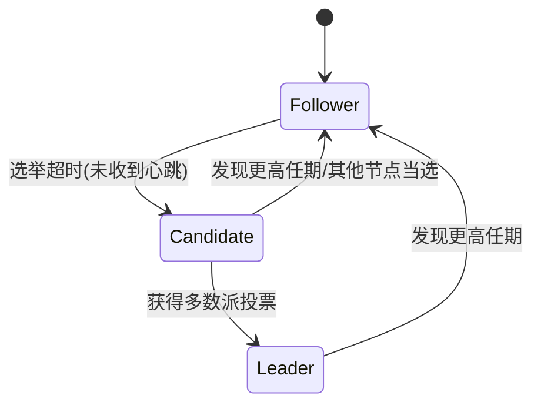
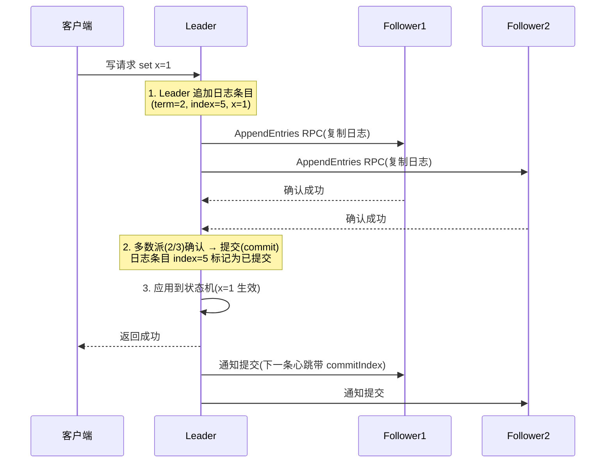

# Raft 与 Paxos 共识算法详解

> 本文是分布式系列第 7 篇，把**共识算法**讲透：为什么需要共识、Raft 的三大子问题（选举/日志复制/安全性）、Paxos 基础、以及 **Raft vs Paxos vs ZAB** 三方对比。
> **版本基线**：Raft 论文（Diego Ongaro & John Ousterhout, 2014《In Search of an Understandable Consensus Algorithm》）、Paxos（Lamport 1998）、ZAB（ZooKeeper）| 创建日期：2026-08-10
> **受众**：后端开发熟手，已懂 CAP/BASE 与 ZooKeeper 基本概念，准备架构/中间件面试或理解 etcd/Consul/TiKV 的原理。
> 前置知识：[00-分布式基础总览](../00-分布式基础总览.md)、[02-CAP与BASE理论详解](02-CAP与BASE理论详解.md)、[00-ZooKeeper总览](../Zookeeper/00-ZooKeeper总览.md)
> 关联笔记：[04-分布式事务详解](04-分布式事务详解.md)（共识与事务的关系）、[03-分布式锁原理详解](03-分布式锁原理详解.md)（ZooKeeper 锁依赖 ZAB）、[Seata分布式事务框架详解](../../Java/中间件/分布式协调/分布式事务/Seata分布式事务框架详解.md)（raft 存储模式）

---

## 1. 学习目标

学完本文你应当能够：

- 说清**共识问题**是什么、为什么分布式系统必须有共识、与"选举/锁"的关系。
- 完整复述 **Raft 的三大子问题**：Leader 选举、日志复制、安全性，画出状态转换图。
- 解释 **Term（任期）** 与选举超时的作用，为什么 Raft 不会出现"脑裂"。
- 讲清**日志复制**的流程与"Leader 强制覆盖"原则、日志匹配性质。
- 理解 **Paxos** 的两阶段（Prepare/Promise、Accept/Learn）与角色（Proposer/Acceptor/Learner），以及活锁问题。
- 对比 **Raft vs Paxos vs ZAB** 的异同（选举方式、日志复制、可理解性），能用于面试。
- 了解成员变更（Joint Consensus）与日志快照（Snapshot）机制。

## 2. 前置知识

- [02-CAP与BASE理论详解](02-CAP与BASE理论详解.md)——一致性模型的基础。
- [00-ZooKeeper总览](../Zookeeper/00-ZooKeeper总览.md)——ZAB 协议的实际应用（ZooKeeper 的共识实现）。
- 需掌握：分布式副本、网络分区、多数派（Quorum）概念。

---

## 3. 核心知识点

### 知识点一：共识问题——分布式系统的基础设施

**一句话记忆**：**共识 = 让一群节点对同一个值达成一致，即使有节点故障或网络分区**。

#### ① 是什么

多个节点各自保存一份数据（副本），客户端写入时，这些节点必须**对"写什么"达成一致**，否则副本间会互相矛盾。共识算法就是解决"如何让 N 个节点可靠地达成一致"的协议。

典型应用：

| 系统 | 用共识做什么 |
|---|---|
| etcd / Consul | 分布式配置、服务发现、分布式锁（Raft） |
| ZooKeeper | 元数据存储、分布式协调（ZAB） |
| TiKV / 分布式数据库 | 数据副本一致性（Raft） |
| Kafka（新版） | 分区副本选主（KRaft，基于 Raft 思想） |
| Seata 2.0+ | TC 集群状态存储（store.mode=raft） |

#### ② 为什么：复制的一致性问题

```
客户端写 value=1 到 3 个副本：
  副本A: value=1  ✅
  副本B: value=1  ✅
  副本C: value=1  ✅
→ 全部一致,没有问题

但如果 C 网络抖动延迟收到：
  副本A: value=1 ✅   副本B: value=1 ✅   副本C: value=?(还在路上)
→ 读 C 的客户端拿到旧值 → 不一致
```

共识算法解决的是：**在部分节点故障/网络分区的情况下，所有正常节点最终对同一份日志（操作序列）达成一致**，从而副本状态收敛相同。

#### ③ 共识的前提：非拜占庭（CFT） vs 拜占庭（BFT）

| 类型 | 故障模型 | 代表性算法 | 应用 |
|---|---|---|---|
| **CFT**（非拜占庭） | 节点可能宕机、消息可能丢失/延迟，但**不撒谎**（不会故意发错误数据） | Paxos、Raft、ZAB | 大多数分布式系统（etcd、ZooKeeper、TiKV） |
| **BFT**（拜占庭） | 节点可能**恶意作恶**（伪造消息、合谋） | PBFT 等 | 区块链、不可信环境 |

> 💡 **记忆锚点**：**Raft/Paxos 防"宕机"，不防"叛变"**。面试常问"Raft 能防恶意节点吗"——不能，那是区块链（BFT）的领域。

#### ④ 核心定理：FLP 不可能定理

- **内容**：在**异步系统**中，只要有一个进程可能故障，就不存在一个算法能**保证**所有进程达成一致。
- **现实解法**：Raft/Paxos 用**超时 + 多数派**规避——把"保证"降级为"大概率/最终"，并假设网络最终会恢复（部分同步模型）。这也是为什么共识算法都有超时机制。

#### ⑤ 多数派（Quorum）思想

```
3 节点集群：至少 2 个节点同意（多数派）才能提交
5 节点集群：至少 3 个节点同意
规则：多数派集合两两相交（2+2 > 3），保证"同一时刻只有一个 leader 能提交"
```

**quorum 的数学性质**：任何两个多数派集合必有交集 → 不可能有两个 leader 同时提交不同值 → 这是共识安全性的根本保障。

#### ⑥ 追问

- 面试官："共识和选举有什么区别？"→ 选举是共识的一种特例（选一个值=leader）；共识是更一般的"对任意值达成一致"。ZAB 的选举只是共识的子过程。

---

### 知识点二：Raft 概述——可理解的共识算法

**一句话记忆**：**Raft 把共识拆成三个独立子问题（选举、日志复制、安全性），用"强领导者 + 任期"简化 Paxos，让算法可教、可学、可实现**。

#### ① 是什么

Raft 是 2014 年提出的**CFT 共识算法**，设计目标是**可理解性**（Paxos 太晦涩）：把共识分解为三个子问题分别解决：

```
Raft 三大子问题
├── 1. Leader 选举：集群中选出一个领导者（Leader）
├── 2. 日志复制：Leader 接收客户端请求，复制日志到所有节点
└── 3. 安全性：保证日志不会回退、状态机按相同顺序执行
```

#### ② 为什么：Raft 的"强领导者"思想

Paxos 所有节点平等，协议复杂；Raft 引入**强领导者（Strong Leader）**：一切写入只走 Leader，Follower 只被动复制。换来的是**清晰易懂 + 易实现**（很多系统手写实现 Raft），代价是写入必须经过 Leader（Leader 是单点，但由选举机制保障高可用）。

#### ③ 节点角色（三态）

| 角色 | 职责 | 转换条件 |
|---|---|---|
| **Leader（领导者）** | 接收客户端写请求、复制日志、发心跳 | 当选成功 |
| **Follower（跟随者）** | 被动响应 Leader、参与投票 | 默认状态；收到合法心跳保持 |
| **Candidate（候选者）** | 发起选举、拉票 | Follower 选举超时未收到心跳 |



#### ④ 任期（Term）——Raft 的时间轴

```
Term 1      Term 2          Term 3
|--选举--|--稳定运行--|--选举--|--稳定--|
          leader A        leader B
```

- **任期是单调递增的整数**，每次选举任期 +1。
- **高任期压过低任期**：节点收到更高任期的消息，立即转为 Follower 并更新任期。
- 任期是 Raft **防脑裂的基石**：两个分区各选一个 leader 时，谁的任期高谁说了算，另一个会被降级。

> 💡 **记忆锚点**：**任期 = Raft 的"逻辑时钟"**，谁任期大谁权威，杜绝"两个 leader 并存"。

#### ⑤ 追问

- 面试官："Raft 为什么比 Paxos 流行？"→ ① 可理解性（三大子问题拆解、论文配动画）；② 实现门槛低（etcd/TiKV 等生产验证）；③ 强领导者模型直觉清晰。Paxos 理论更早更一般，但工程实现大多借鉴 Raft 的组织方式。

---

### 知识点三：Leader 选举

**一句话记忆**：**Follower 超时没听到心跳就自荐当 Candidate，任期+1 拉票，得多数派票当选 Leader，然后疯狂发心跳巩固地位**。

#### ① 选举流程

```
1. Follower 启动随机选举超时（150~300ms，随机避免同时选举）
2. 超时未收到 Leader 心跳 → 任期+1 → 转为 Candidate
3. 投自己一票，向所有节点发 RequestVote RPC
4. 收到多数派投票 → 当选 Leader → 立即发心跳（AppendEntries 空日志）
5. 未得多数票（平票/分区）→ 等下一个随机超时再选
```

#### ② 投票规则（选举限制）

| 规则 | 内容 | 目的 |
|---|---|---|
| **任期唯一** | 每个任期只能投一票（先到先得） | 防止一任多票 |
| **日志新者优先** | 投票者只投给"日志不比自己旧"的 Candidate | 保证新 Leader 包含全部已提交日志（安全性） |
| **多数派** | 得票数 > N/2 才能当选 | 保证只有一个 Leader |

**日志新旧比较**：先比**最后一条日志的任期**，任期大者新；任期相同比**日志索引**，索引大者新。

#### ③ 防脑裂：为什么不会出现两个有效 Leader

```
5 节点集群,网络分区为 {A,B} 和 {C,D,E}
- 分区1(2节点): A 自荐,最多得 2 票 < 3 → 当选失败
- 分区2(3节点): C 自荐,得 3 票 ≥ 3 → 当选成功 ✅
→ 只有包含多数派的那个分区能选出 Leader,少数派分区永远选不出
```

**核心**：选举必须**多数派同意**，而多数派集合唯一（任意两个多数派相交）→ 同一时刻只有一个 Leader 能通过多数派验证。

#### ④ 选举超时与随机化

- 选举超时（election timeout）随机 150~300ms：如果所有 Follower 同时超时同时自荐，会反复平票（split vote）。
- 随机化让节点**错开**自荐时间，大概率快速选出唯一 Leader。
- 生产参数：`election-timeout-ms`（如 Seata raft 默认 1000ms）、心跳间隔一般为超时的 1/5~1/10。

#### ⑤ 追问

- 面试官："Leader 挂了多久集群不可用？"→ 一个选举超时周期（如 300ms~1s），期间写入不可用（读可用看配置）；这是 Raft 的可用性代价，所以心跳间隔和超时要权衡。

---

### 知识点四：日志复制（Log Replication）

**一句话记忆**：**客户端写请求 → Leader 追加日志 → 复制到 Follower → 多数派确认 → 提交并应用到状态机——日志一致了，状态自然一致**。

#### ① 流程（以"客户端 set x=1"为例）



#### ② 关键概念

| 概念 | 说明 |
|---|---|
| **日志条目** | 每条含 `(term, index, 命令)`，index 全局单调递增 |
| **prevLogIndex/prevLogTerm** | 每条 AppendEntries 带前一条日志的任期+索引，用于**一致性检查** |
| **commitIndex** | Leader 已知的已提交索引（多数派确认过的） |
| **matchIndex / nextIndex** | Leader 跟踪每个 Follower 的复制进度 |

#### ③ 日志匹配性质（Log Matching Property）

```
如果两个节点上的日志条目有相同的 (index, term)，那么这两条之前的所有日志也完全相同
```

- 靠 **AppendEntries 的一致性检查**保证：Follower 发现 prevLogTerm 不匹配 → 拒绝 → Leader 回退 nextIndex 重试 → 直到找到共同前缀。
- **Leader 强制覆盖**：遇到冲突的日志条目，Leader 直接覆盖 Follower 的（以 Leader 为准）。Follower 永远不自己改日志。

#### ④ 提交（Commit）规则

- **只有 Leader 能提交**：日志条目复制到**多数派**后，Leader 标记提交。
- **安全性保证**：提交的日志条目**永不丢失**（新 Leader 一定包含全部已提交日志——靠选举限制保证）。
- **不提交旧任期日志直接计数**：Leader 当选后，会先提交一条**本任期的空日志（no-op）**，之后才推进 commitIndex——避免"间接提交"导致的日志回退。

> ⚠️ **易错点**：面试常问"Leader 能否提交前一个任期的日志条目？"——**不能直接**（可能覆盖已提交日志）；要等本任期日志提交后一起推进 commitIndex。

#### ⑤ 追问

- 面试官："日志复制为什么必须多数派？"→ 多数派两两相交：新 Leader（来自多数派）必然包含旧 Leader 已提交（已在多数派上）的日志 → 已提交日志不会丢。

---

### 知识点五：安全性（Safety）

**一句话记忆**：**Raft 的安全性 = 选举限制（新 Leader 必有全部已提交日志）+ 提交规则（只提交多数派确认的）+ 状态机安全（同序执行）**。

#### ① 三个安全性质

| 性质 | 内容 | 靠什么保证 |
|---|---|---|
| **选举安全** | 任一任期最多一个 Leader | 多数派 + 每任期一票 |
| **日志安全** | Leader 不会覆盖已提交的日志条目 | 选举限制（新 Leader 日志最新） |
| **状态机安全** | 所有节点按相同顺序执行相同命令 | 日志一致 + 相同 commitIndex 推进 |

#### ② 为什么"日志最新的当选"是安全的

已提交的日志一定在**多数派**上；新 Leader 必须拿到**多数派**的选票。两个多数派相交 → 新 Leader 的日志中**至少包含一个已提交日志所在的节点** → 新 Leader 日志 ≥ 已提交日志（选举限制保证不丢）。

#### ③ 客户端交互与线性一致性（可选进阶）

- 客户端只能写 Leader；读也可以只读 Leader（但可能读到旧数据，除非用 ReadIndex/Lease 优化）。
- **线性一致性**：所有操作按某种全局顺序，读能读到"之前所有已提交写入"的结果。etcd 默认保证线性一致性读（通过 ReadIndex 或 Leader 心跳租约）。

#### ④ 追问

- 面试官："Raft 能保证线性一致性吗？"→ 写是线性一致的；读默认不一定（可能读到旧值），需要 ReadIndex（向多数派确认 commitIndex）或租约读（Leader 心跳租约内直接读）优化。

---

### 知识点六：成员变更（Membership Change）

**一句话记忆**：**集群扩缩容不能一步切换配置（会脑裂），要经过 Joint Consensus 两阶段过渡**。

#### ① 问题：为什么不能直接改配置

```
旧配置 3 节点 {A,B,C} → 新配置 3 节点 {A,B,D}（C 换 D）
如果某个时刻旧配置用多数派、新配置也用多数派:
- 旧配置多数派 {A,B} ✅
- 新配置多数派 {A,B} ✅（刚好一致）
但如果 C 还在旧配置里且 A 分区分裂:
- 旧配置: {A,C} 认为 A 是 Leader
- 新配置: {A,D} 认为 A 是 Leader → 两个 Leader!
```

**本质**：新旧配置的多数派可能不重叠 → 直接切换会同时选出两个 Leader。

#### ② 解决：Joint Consensus（联合共识）

```
阶段1: 集群进入"联合配置" C_old + C_new（两类配置的多数派都满足）
        → 提交需要 旧多数派 ∩ 新多数派 都同意
阶段2: 日志条目追加 C_new → 集群切换到新配置
        → 之后只用新配置的多数派
```

- 任何时刻，两个配置的多数派**必然相交**（因为各自多数派内部相交）→ 不会选出两个 Leader。
- 工程简化：etcd 用**单节点变更**（每次只增/删一个节点）规避联合共识的复杂性。

#### ③ 追问

- 面试官："etcd 扩缩容怎么保证安全？"→ 一次只变更一个节点（Learner 模式先加入不参与投票，数据追平后再转正），避免双 Leader。

---

### 知识点七：日志快照（Snapshot）

**一句话记忆**：**日志无限增长会撑爆磁盘，定期把状态机状态存成快照，丢弃旧日志，新节点/落后节点用快照追赶**。

#### ① 为什么需要快照

日志条目包含全部历史操作，无限增长 → 磁盘、回放耗时都不可接受。定期打快照（状态机的当前状态 + 已包含的日志索引/任期），删除快照之前的日志。

#### ② 流程

```
Leader 状态机状态 + commitIndex → 序列化 → 存储快照
1. 本地快照：Leader/Follower 自己按阈值触发（如 10000 条日志）
2. 追赶快照：Follower 落后太多（nextIndex < 快照索引）→ Leader 发 InstallSnapshot RPC
3. Follower 安装快照 → 丢弃旧日志 → 从快照后继续复制
```

#### ③ 与"日志重放"的关系

- 正常恢复：节点重启 → 从快照恢复状态 → 重放快照之后的日志。
- 落后节点：直接装快照，不必从头重放全部日志。
- 快照本身也占磁盘，通常快照 + 保留一段日志（如 etcd `--snapshot-count`）。

#### ④ 追问

- 面试官："快照和日志哪个是权威？"→ 都是，快照是"压缩过的日志"；一致性靠快照里记录的 (index, term) 与日志衔接。

---

### 知识点八：Paxos 基础（Basic Paxos）

**一句话记忆**：**Paxos 用两阶段（Prepare/Promise、Accept/Learn）+ 多数派 + 编号约束，让多个提案者对同一值达成一致——但难懂、有活锁**。

#### ① 角色

| 角色 | 职责 |
|---|---|
| **Proposer（提案者）** | 提出提案（编号 + 值） |
| **Acceptor（接受者）** | 投票/存储提案，多数派接受则定案 |
| **Learner（学习者）** | 学习最终确定的值（可并入 Acceptor） |

#### ② 两阶段流程

```
阶段1 Prepare:
  Proposer 生成提案编号 n → 广播 Prepare(n)
  Acceptor 回复 Promise: 承诺不再接受编号 < n 的提案,
  并返回自己已接受的最高编号提案(若有)
  多数派回复 → 阶段1通过

阶段2 Accept:
  Proposer 用"编号最高且已被接受的值"(若无则用自己的值) 发 Accept(n, value)
  Acceptor 接受并回复
  多数派接受 → 值被确定 → Learner 学习
```

**关键约束**：Acceptor 一旦 Promise 了编号 n，就不再接受编号 < n 的提案 → 保证"编号高的提案能覆盖编号低的，且值不丢"。

#### ③ 活锁（Liveness）问题

```
P1 发 Prepare(1) → 部分 Promise
P2 发 Prepare(2) → 部分 Promise（覆盖了 1）
P1 发 Prepare(3) → 覆盖 2 ...
→ 提案编号互相追高，永远无法进入 Accept 阶段 → 活锁
```

**解决**：选一个 **Leader（Distinguished Proposer）**，只有 Leader 提案 → 退化为 Multi-Paxos。这正说明"Paxos 也隐含领导者思想"。

#### ④ Basic Paxos vs Multi-Paxos

| 维度 | Basic Paxos | Multi-Paxos |
|---|---|---|
| 每轮 | 每值一次两阶段 | Leader 选举后，日志条目直接 Accept（省 Prepare） |
| 效率 | 低（每写 2 次 RTT） | 高（选举后 1 次 RTT） |
| 角色 | 对等 | 有 Leader |
| 使用 | 理论教学 | 工程（Raft 就是 Multi-Paxos 的简化实现） |

#### ⑤ 追问

- 面试官："Paxos 和 Raft 的哲学区别？"→ Paxos 追求**数学优雅**（对等角色、少数约束），Raft 追求**可理解性**（拆子问题、强 Leader）。两者安全性等价，Raft 更易实现。

---

### 知识点九：Raft vs Paxos vs ZAB 三方对比（面试高频）

**一句话记忆**：**三者都是 CFT 共识，Raft 与 ZAB 是"工程化 Paxos"——Raft 靠任期+强 Leader，ZAB 靠事务 ID + 两阶段提交，Paxos 是理论基石**。

| 维度 | Paxos | Raft | ZAB（ZooKeeper） |
|---|---|---|---|
| 提出时间 | 1998（Lamport） | 2014（Ongaro） | 2008（Yahoo） |
| 定位 | 理论协议 | 工程共识算法 | ZooKeeper 专用协议 |
| 领导者 | 无（Multi-Paxos 隐含） | **强 Leader** | **Leader + Follower + Observer** |
| 时间机制 | 无显式任期 | **Term（任期）** | **ZXID（事务 ID，高 32 位任期+低 32 位序号）** |
| 选举 | 无显式选举（隐含） | 任期+随机超时+日志新旧 | 优先选"数据最新"的节点（类似 Raft 日志新旧） |
| 日志复制 | Accept 阶段 | AppendEntries | **两阶段提交**（Proposal + Commit 广播） |
| 提交确认 | 多数派 | 多数派 | 多数派 |
| 可理解性 | 低（晦涩） | **高**（论文+动画） | 中 |
| 典型实现 | 理论/教科书 | etcd、Consul、TiKV、Kafka KRaft、Seata raft | ZooKeeper |
| 与 Raft 关键差异 | — | — | ZAB 提交是"广播式两阶段"，Raft 是"Leader 单方面推进 commitIndex" |

#### 相似点（面试先说这些）

- 都是 **CFT + 多数派 + 日志复制** 的思路。
- 都有 **Leader + 心跳 + 超时重选**。
- 选举都优先"日志最新"的节点（ZAB 的 ZXID 大者优先 = Raft 的日志新者优先）。

#### 关键差异（面试加分）

1. **Raft 的提交是"隐式"**：Leader 推进 commitIndex，Follower 在下次心跳/AppendEntries 时得知；**ZAB 的提交是"显式广播"**：Leader 发 Commit 消息，Follower 收到才提交——ZAB 更像 2PC。
2. **ZXID vs Term+Index**：ZAB 用单一递增 ZXID（任期+序号编码），Raft 用 (term, index) 二元组。
3. **ZAB 没有"日志覆盖"概念**：ZooKeeper 数据变更走两阶段，Leader 崩溃后选"事务最新"的节点，直接沿用其数据；Raft 有 Leader 强制覆盖机制。
4. **Observer（观察者）**：ZAB 支持只读不投票的 Observer（读扩展）；Raft 原版无，但工程实现（如 TiKV）有类似 Learner/只读节点。

> 💡 **记忆锚点**：**Raft = Paxos 的"教学版"，ZAB = ZooKeeper 的"专用 2PC 版"**。面试答"三者都是多数派共识"→ 再补"Raft 强 Leader+任期、ZAB 显式提交+ZXID"就到位了。

#### 追问

- 面试官："Kafka 的 KRaft 和 ZooKeeper 的 ZAB 有啥关系？"→ KRaft 是 Kafka 自研的 Raft 变体（替代 ZooKeeper 做元数据共识），核心思想同 Raft：选主 + 日志复制 + 多数派。

---

### 知识点十：共识算法在工程中的选型视角

**一句话记忆**：**要共识就选 Raft 系（etcd/Consul/TiKV 现成实现），别自研；自研必踩活锁/脑裂/日志回退三大坑**。

#### ① 什么时候真的需要"自己写共识"

| 场景 | 建议 |
|---|---|
| 需要强一致的分布式配置/注册中心 | 直接用 etcd / Consul / ZooKeeper（别自研） |
| 业务系统需要分布式锁 | 用 Redis/etcd 现成锁，不需要懂共识实现 |
| 数据库/存储做副本一致性 | 集成 Raft 库（braft、etcd raft、hashicorp/raft） |
| 面试/学习 | 手写迷你 Raft（选举+日志复制）加深理解 |

#### ② 工程实现的常见坑

- **活锁/平票**：随机超时没做好 → 反复选举。
- **脑裂**：旧 Leader 未察觉自己失联继续接受写 → 需要任期检查 + 拒绝旧任期请求。
- **日志回退**：提交规则没遵守（如提交旧任期日志）→ 已提交日志被覆盖。
- **快照与日志衔接**：快照后的 InstallSnapshot 与日志复制的 nextIndex 对不上。
- **成员变更**：一步切换配置 → 双 Leader。

#### ③ 追问

- 面试官："etcd 为什么用 Raft 不用 Paxos？"→ 工程可理解性 + 成熟实现 + 社区验证；安全性两者等价，Raft 的开发/运维成本低。

---

## 4. 最佳实践

- **选现成实现**：etcd（Raft）、Consul（Raft）、ZooKeeper（ZAB），业务系统别自研共识。
- **集群节点数取奇数**：3/5/7，容忍 N/2 台故障；偶数节点无收益还浪费（3 和 4 都只能挂 1 台）。
- **选举超时 vs 心跳权衡**：心跳 100~500ms、超时 1s 左右；太短频繁选举，太长故障恢复慢。
- **客户端线性一致性读**：需要强读用 ReadIndex/租约，别裸读 Leader（可能旧数据）。
- **成员变更用单节点增量**：避免 Joint Consensus 的实现复杂度。
- **快照策略**：按日志条数/字节数阈值触发，保留最近 N 条日志衔接。
- **监控**：Leader 变更次数、选举延迟、日志落后节点数（落后=故障隐患）。

## 5. 常见踩坑

- 把 Raft 当 BFT——它防宕机不防恶意节点（区块链才是 BFT）。
- 以为 Raft 保证线性一致性读——**默认不保证**，需要 ReadIndex/租约。
- 认为"两个多数派能同时选两个 Leader"——多数派两两相交，数学上不可能。
- 提交旧任期日志——必须等本任期 no-op 日志提交后再推进 commitIndex。
- 偶数节点集群——无容错收益（4 节点和 3 节点都只能挂 1 台）。
- 直接改集群配置（成员变更）——必须 Joint Consensus 或单节点增量。
- 心跳间隔=选举超时——必然频繁选举（必须超时 > 心跳，留出余量）。

## 6. 小结

- 共识 = 多数派 + 日志复制，解决"多副本对同一操作序列达成一致"。
- **Raft 三大子问题**：选举（任期+随机超时+日志新旧）、日志复制（AppendEntries+提交规则）、安全性（选举限制+状态机安全）。
- **Paxos** 两阶段（Prepare/Promise、Accept/Learn）+ 活锁问题 → Multi-Paxos 隐含 Leader。
- **三方对比**：Raft 强 Leader+任期、ZAB 显式两阶段提交+ZXID、Paxos 理论基石；都是 CFT+多数派。
- 工程选型：直接用 etcd/Consul/ZooKeeper，别自研。

## 7. 关联笔记

- 下一篇（应用）：[00-ZooKeeper总览](../Zookeeper/00-ZooKeeper总览.md)——ZAB 是共识在 ZooKeeper 的实现（对照本篇知识点九）。
- 理论基础：[02-CAP与BASE理论详解](02-CAP与BASE理论详解.md)、[00-分布式基础总览](../00-分布式基础总览.md)
- 协同应用：[03-分布式锁原理详解](03-分布式锁原理详解.md)（ZooKeeper 锁依赖 ZAB）、[04-分布式事务详解](04-分布式事务详解.md)
- 框架落地：[Seata分布式事务框架详解](../../Java/中间件/分布式协调/分布式事务/Seata分布式事务框架详解.md)（知识点十四 raft 存储模式 = Raft 的实际工程应用）

## 8. 参考资料

- Ongaro & Ousterhout：《In Search of an Understandable Consensus Algorithm》(Raft 论文, 2014)——raft.github.io
- Lamport：《The Part-Time Parliament》(1998)、《Paxos Made Simple》(2001)
- ZooKeeper 论文：《Zab: High-performance broadcast for primary-backup systems》(2011)
- [The Raft Consensus Algorithm（官方动画+交互演示）](https://raft.github.io/)
- [etcd Raft 文档](https://etcd.io/docs/latest/learning/why-etcd/)
- 面试素材：`/Users/lub/Desktop/学习/跟AI学技术/面试笔记/后端工程师面试/分布式系统/`（分布式相关已吸收）
