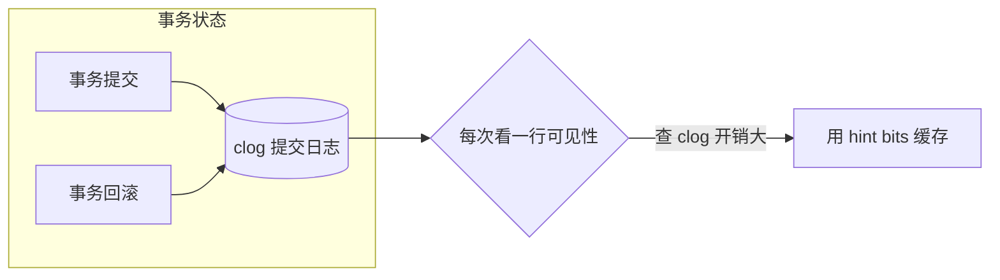
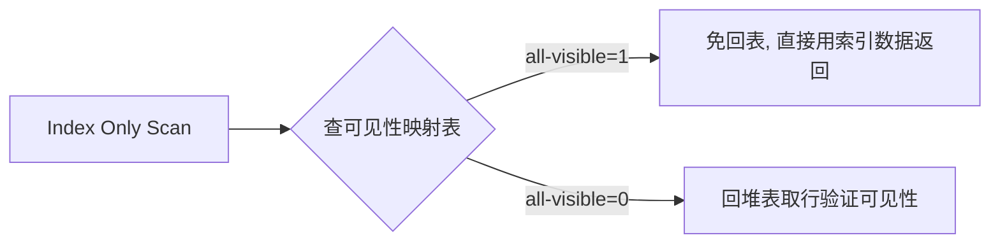
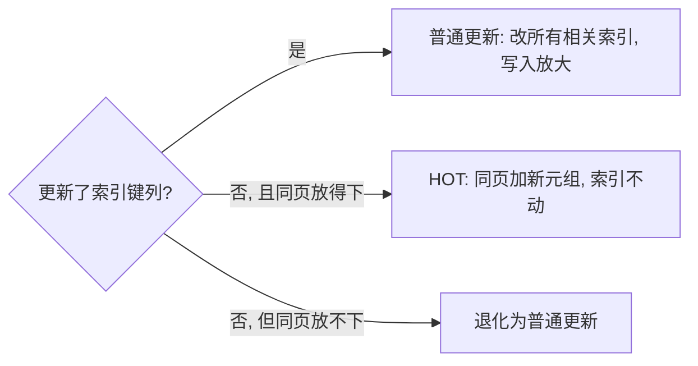
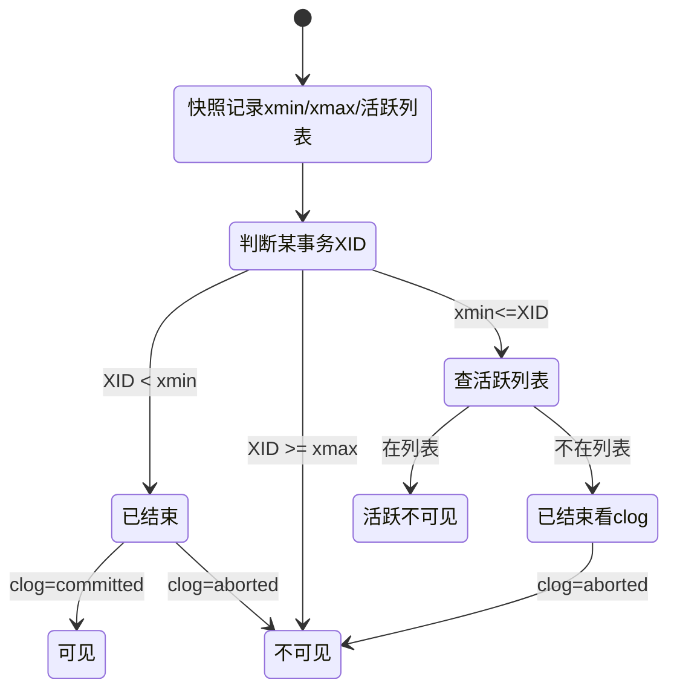
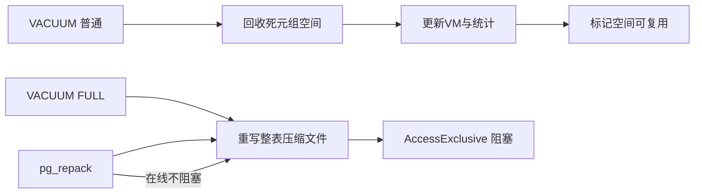

# MVCC 深入原理

> **一句话记忆**：PostgreSQL 的 MVCC = **行上打两个事务 ID 戳（xmin/xmax）+ 提交日志（clog）判状态 + 可见性映射表（VM）加速 + 后台 VACUUM 打扫战场**。读不阻塞写、写不阻塞读全靠"旧版本留着、查询看快照"。

**本篇定位**：原理深挖篇，接续 [06-事务详解](../01-基础/06-事务详解.md) 第 9.8 节的 MVCC 基础。**基础用法（xmin/xmax/隔离级别/2PC）见事务详解，本篇只讲底层机制**。理论型笔记，重原理与易懂载体，不堆实操命令。

---

## 📋 总纲

1. MVCC 本质与两套方案对比
2. 页面与元组布局（HeapTupleHeader 逐字节）
3. 提交日志 clog 与提示位 hint bits
4. 可见性判断的完整链路
5. 可见性映射表 Visibility Map
6. HOT 更新（堆内元组）原理
7. 快照构建（事务表 + clog）
8. VACUUM 内部：lazy vs FULL
9. 长事务 → 膨胀链路
10. MVCC vs MySQL InnoDB（互链对照）
11. 小结

---

## 1. MVCC 本质：多版本并发控制

**是什么**：MVCC（Multi-Version Concurrency Control）让同一行数据同时存在多个历史版本，每个事务看到自己"应该看到"的版本，从而读写互不阻塞。

**一句话记忆**：MySQL 靠**回滚段 undo** 存旧版本；PostgreSQL 靠**堆表里多留几行旧版**。方向相反，殊途同归。

**为什么（生活类比）**：就像共同编辑一份文档——每个人看到的都是"自己打开时那版"，别人怎么改都不影响自己阅读；提交了，别人下次刷新才看到新版。旧版不是凭空造出来的，是"改动时没直接删掉旧页，而是新写一页"。

**两套方案对比**（已在通用篇详述，此处一句话）：PG 靠堆表多留旧版 + VACUUM，MySQL 靠 undo log 回滚段 + purge——方向相反，殊途同归。完整对比表见 **[03-关系型DB-MVCC详解](../../DB通用理论/03-关系型DB-MVCC详解.md) §2**。

> 🔑 理解主线：PG 的 MVCC 是一条"**写了不删、旧版留着、靠戳判断、定期打扫**"的流水线。本篇每个机制都是这条线上的一个环节。

---

## 2. 页面与元组布局（逐字节看）

> 📌 官方文档：Database Page Layout。这是源码级基础，理解了它 MVCC 就是"戳的位置"问题。

### 2.1 页面 Page 结构

数据以固定 8KB 页面存储（可编译期改）。一个页的结构：

```
┌──────────────────────── 8KB Page ────────────────────────┐
│ PageHeaderData (24字节): pd_lsn/pd_checksum/pd_lower/pd_upper │
│ 元组1 (HeapTuple)                                          │
│ 元组2 (HeapTuple)                                          │
│ ...                                                        │
│ ←──────── 空闲空间 (pd_lower 和 pd_upper 之间) ─────────→   │
│ 行指针1 ItemId / 行指针2 ...                               │
│ 行指针区 (从页尾部向上生长)                                │
└────────────────────────────────────────────────────────────┘
```

- **PageHeaderData（24 字节）**：`pd_lsn`（最近修改该页的 WAL 位置）、`pd_lower`/`pd_upper`（空余区间指针）、`pd_checksum` 等。
- **行指针 ItemId**：从页尾部向下生长，每个 ItemId 指向页内一个元组的偏移。**HOT 链的关键就在这里**——一个 ItemId 能通过 `lp_next` 串起多个同键元组版本。
- 行数据**不能跨页**，超长走 TOAST（见 **06-Buffer与存储原理**（见知识库））。

### 2.2 元组 HeapTuple 头部（核心戳）

每个元组以一个头部开头，MVCC 的可见性全靠这几个字段：

| 字段 | 大小 | 含义 | MVCC 作用 |
|------|------|------|-----------|
| `t_xmin` | 4B | **插入该元组版本的事务 ID** | 决定"谁创建了这个版本" |
| `t_xmax` | 4B | **删除/更新该版本的事务 ID**，0=存活 | 决定"这个版本被谁作废" |
| `t_cid` | 4B | 同一事务内创建/删除该版本的命令号 | 同事务内区分多次操作 |
| `t_xvac` | 4B | VACUUM FULL 用的旧事务 ID | 极少用 |
| `t_ctid` | 6B | 指向当前/下一个版本的位置（块号,槽号） | **HOT 链的指针** |
| `t_infomask2` | 2B | 属性数与 HOT 状态位 | 标记 HOT |
| `t_infomask` | 2B | **提示位 hint bits**（见 §3） | 加速可见性判断 |
| `t_hoff` | 1B | 头部长度的偏移 | 定位数据起点 |

**t_ctid 与版本链**：初版元组的 `t_ctid` 指向自己；更新后旧版本的 `t_ctid` 指向新版本（HOT 时指向同页新版本）。查询沿链找最新。

> 💡 **关键理解**：一个逻辑行 = **一串由 t_ctid 串起来、由 xmin/xmax 标记版本的元组**。当前最新版、历史版都躺在一张表里（可能跨页、跨块）。

---

## 3. 提交日志 clog 与提示位 hint bits

**是什么**：事务提交/回滚的状态不能靠"猜"，需要一个地方记录——这就是 **clog（Commit Log，提交日志）**，`pg_xact/` 目录下，按事务 ID 记录 `in_progress / committed / aborted` 三种状态。



**问题**：每次判断一行都要查 clog（要去读日志位），太慢。

**解决——hint bits（提示位）**：元组头部的 `t_infomask` 里存几个**布尔提示位**，把已确定的事务状态直接缓存下来：

- `HEAP_XMIN_COMMITTED`：插入事务已提交 → 不用再查 clog
- `HEAP_XMIN_INVALID`：插入事务已中止 → 该版本无效
- `HEAP_XMAX_COMMITTED`/`HEAP_XMAX_INVALID`：删除事务的状态

**运作**：某事务提交后，后续访问它的元组时**顺手把提示位写死**（`MarkBufferDirtyHint` 标脏该页）。下次再判断就不用查 clog，直接读位。

> 💡 **一句话记忆**：clog 是"事务状态的档案室"，hint bits 是"常去档案室的人顺手贴的便签"——大部分时候看便签就够了，不用再跑档案室。

---

## 4. 可见性判断的完整链路

判断"当前事务能否看到这个元组版本"是 MVCC 的心脏。规则可归纳为：

```
一个元组版本可见 ⟺ 满足"来源可见"且"未被作废"：
  ① 来源可见：xmin 对应事务已提交（clog/hint bits 判）
  ② 未被作废：xmax=0（还活着） 或 xmax 事务不可见（未提交/已中止）
```

分场景拆解（高频考点）：

| 场景 | 判定 |
|------|------|
| 已提交事务插入、xmax=0 | ✅ 可见 |
| 事务还在进行、xmin=本事务自己 | ✅ 本事务看得到自己的修改 |
| xmin 是已提交事务 | 看 xmax |
| xmax=0 | ✅ 版本存活，可见 |
| xmax=本事务 | ❌ 本事务已删/已改，不可见 |
| xmax=已中止事务 | ✅ 删除没生效，版本仍可见 |
| xmax=已提交事务 | ❌ 版本已被删除，不可见 |

**结合快照**（见 §7）：不仅要看 clog，还要看**该事务是否在"活跃事务集合"里**——活跃事务（未提交）的修改对当前事务不可见，哪怕它 clog 显示还没提交。

> 🔑 **为什么读不阻塞写**：写操作只是插入新版本 + 标旧版本 xmax，**不改已有版本内容**；读操作按快照规则挑版本，**不加锁**。两个方向完全不碰同一份数据，自然不互等。

---

## 5. 可见性映射表 Visibility Map（VM）

**是什么**：每个堆表带一个附属文件 `<表名>_vm`，用**每个页 2 个位**标记：
- **all-visible 位**：该页所有元组对所有已提交事务可见（页面"干净"，无需逐行判断）
- **all-frozen 位**：该页所有元组已冻结（见 §8 XID 冻结）

**两大作用**：
1. **加速 VACUUM**：VACUUM 只扫 `all-visible=0` 的页（有死元组的页），干净页直接跳过。
2. **实现 Index-Only Scan（仅索引扫描）**：索引里没有 xmin/xmax，回表前先看 VM——若该页 all-visible，可直接用索引里的 TID 返回数据，**省掉回表验证可见性**。



> ⚠️ **为什么 VM 会被"打脸"**：一个页面标记 all-visible 后，某事务又往该页插了新行——新行还不可见。所以 VM 位是**暂态缓存**，INSERT/UPDATE/DELETE 会清除相关页的 all-visible 位，直到下次 VACUUM 重新标记。

> 💡 **一句话记忆**：VM 是 VACUUM 和仅索引扫描的"偷懒地图"——标记哪些页不用细看。

---

## 6. HOT 更新（Heap-Only Tuple）

**问题**：普通 UPDATE 若改了索引列，要在索引里删除旧 entry + 插入新 entry，写入放大（尤其多索引）。若新版本和旧版本**离得远（不同页）**，还要多个索引都改。

**HOT 优化**：当更新**不涉及任何索引键列** 且 **新版本能放进同一页** 时，走 HOT：
- 新版本元组放在**同一数据页**，通过 `t_ctid` 指回旧版本（形成 HOT 链）
- **索引只保留一个 entry**（指向链头），查询沿链找到最新版
- 省掉了所有索引的更新操作



**HOT 生效条件**（三条缺一不可）：
1. 更新涉及的列**都不在索引键里**
2. 新版本元组能放进**当前数据页**
3. 该页的 HOT 状态允许（页面没有阻塞 HOT 的条件）

> ⚠️ **HOT 失效的坑**：如果表上**无索引的更新触发**不了 HOT（本质是第二个条件不满足——页面太满放不下新版本），或更新了被索引列 → 走普通更新，索引膨胀。

**效果**：Hot 更新极大减少索引写入放大，是 OLTP 高更新负载下 PG 性能的关键。这也是为什么**频繁 UPDATE 的表建议 `fillfactor < 100`**（留页内空间让 HOT 能命中，见 **06-Buffer与存储原理**（见知识库））。

---

## 7. 快照构建（事务表 + clog）

**是什么**：查询/事务要确定"我能看到哪些事务的修改"，需要一张**快照**——即"当前活跃事务集合 + 当前事务自己的 XID"。

**快照组成**（`txid_current_snapshot()` 的 `xmin:xmax:list`）：
- `xmin`：最早的可能未提交事务 ID
- `xmax`：下一个待分配的事务 ID（≥xmax 的一定看不到）
- 活跃列表 `list`：介于 xmin/xmax 之间的活跃（未提交）事务 ID

**可见性判断整合**：
- `xid < xmin`：事务一定已结束 → 看 clog
- `xid >= xmax`：事务还没开始 → 不可见
- `xmin <= xid < xmax`：查活跃列表；在列表里 → 活跃不可见；不在 → 已结束看 clog



**隔离级别决定快照粒度**：
- **Read Committed**：**每条语句**取新快照 → 同一事务内两次查询结果可能不同（可见别人新提交的）
- **Repeatable Read / Serializable**：**事务第一条语句**取快照，全程复用 → 事务内读一致

> 💡 **一句话记忆**：快照 = "哪些事务还没干完"的名单。RC 每次点外卖都重看一次名单；RR 开头看一次就锁死。

---

## 8. VACUUM 内部：lazy vs FULL

**问题**：MVCC 不断产生死元组（被更新/删除的旧版本），不及时清就会表膨胀。清理者是 VACUUM。

**VACUUM（普通 / lazy VACUUM）**：
- 扫 `all-visible=0` 的页，**回收死元组占用的页内空间**
- **不压缩文件、不重写表**，空出来的空间标记可复用
- 更新 VM、更新统计、处理 XID 冻结
- 锁级别：**AccessShare**（不阻塞读写）✅
- 可并发运行多个，autovacuum 自动触发

**VACUUM FULL**：
- **重写整个表**为新文件，物理压缩到最小（消除页内碎片 + 压缩文件）
- 锁级别：**AccessExclusive**（阻塞一切）❌
- 相当于 `CLUSTER` 的物理重排，代价高
- 生产上能用 `pg_repack` 在线替代



| 对比 | VACUUM | VACUUM FULL |
|------|--------|-------------|
| 压缩文件 | 否 | 是 |
| 锁 | AccessShare（不阻塞） | AccessExclusive（阻塞） |
| 代价 | 低，后台跑 | 高，重写全表 |
| 何时用 | 常规清理、autovacuum | 表严重膨胀、空间回收 |
| 在线替代 | 无 | pg_repack |

**XID 冻结（FREEZE）**：事务 ID 是 32 位，约 20 亿次后回卷（变负数）。VACUUM 会把足够老的已提交元组的 xmin 改为 `FrozenTransactionId`（2 ），标记"永远可见"，避免回卷灾难。VM 的 all-frozen 位配合记录已冻结页。

---

## 9. 长事务 → 膨胀链路（生产头号杀手）

> 📌 这是生产事故高发区，面试必考"长事务的危害"。


**机制**：VACUUM 只回收"对任何现存事务都不可见"的死元组。只要有一个长事务的旧快照仍能看到某版本，这个版本就不能清——于是死元组越积越多，表和索引一起膨胀，查询需要扫更多页，变慢；磁盘暴涨。

**监控与治理**：
- 监控长事务：`SELECT pid, now() - xact_start FROM pg_stat_activity WHERE now() - xact_start > interval '1 minute';`
- 设 `idle_in_transaction_session_timeout` 自动断开空闲事务
- 监控膨胀比例（`n_dead_tup / n_live_tup`），超阈值 `VACUUM FULL` / `pg_repack`
- **业务层**：事务尽量短、不在事务里等用户交互、避免隐式长事务（如 ORM 会话长期不提交）

> 💡 **一句话记忆**：长事务是膨胀的"免死金牌"——它看得到的旧版本，VACUUM 一律不敢动。

---

## 10. MVCC vs MySQL InnoDB（对照，互链）

> 📌 深浅对照表已统一迁至通用篇 **[03-关系型DB-MVCC详解](../../DB通用理论/03-关系型DB-MVCC详解.md) §2 / §4**。此处仅留 PG 侧底层机制差异的核心指针：

| 维度 | PostgreSQL | MySQL InnoDB |
|------|-----------|--------------|
| 旧版本载体 | 堆表多版本元组（xmin/xmax） | undo log 回滚段 |
| 底层机制特色 | clog/hint bits/VM/HOT（本节 §3~§6） | undo + Next-Key（MySQL 占位待补，见通用篇 §5） |

> 📌 深入对比见 **[03-关系型DB-MVCC详解](../../DB通用理论/03-关系型DB-MVCC详解.md)**；PG 侧基础用法对比见 [06-事务详解](../01-基础/06-事务详解.md) §9.8.9。本笔记其余章节（元组布局/clog/hint bits/VM/HOT/VACUUM/快照/膨胀）为 PG 底层实现，不改动。

---

## 11. 小结

- MVCC 本质 = **多留旧版本 + 戳判断 + 定期清理**，PG 靠堆表多版本元组，InnoDB 靠 undo log。
- 元组头部 `xmin/xmax` 是可见性核心；clog 记事务状态，hint bits 缓存加速。
- VM 加速 VACUUM 和仅索引扫描；HOT 减少索引写入放大。
- 快照 = 活跃事务集合，RC 每语句刷新、RR 事务首快照。
- VACUUM 回收死元组不压缩、VACUUM FULL 重写压缩；XID 冻结防回卷。
- 长事务是膨胀头号杀手，必须监控治理。

## 下一篇

- 接续：**04-查询优化器与成本模型**（见知识库）（规划器如何利用统计信息）
- 存储基础：**06-Buffer与存储原理**（见知识库）（页/TOAST/缓冲池，本笔记页面布局的延伸）
- 基础用法回看：[06-事务详解](../01-基础/06-事务详解.md)
