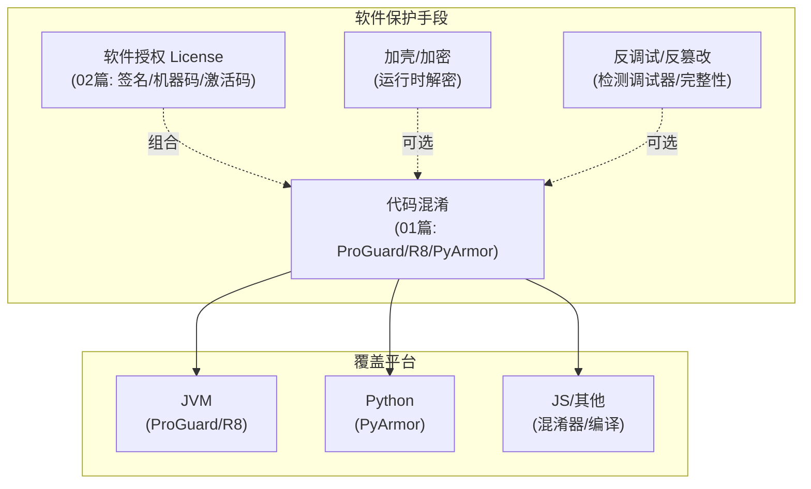

# 00-软件保护总览

> 版本基线：2026-08 整理，覆盖代码混淆、软件授权 License（跨语言）
> 受众：需要保护发布代码不被轻易逆向的开发/发布者。默认懂代码编译与打包基础。
> 关联笔记：[01-代码混淆详解](01-代码混淆详解.md)、[02-License授权详解](02-License授权详解.md)、**00-通用技术总览**（见知识库）

## 📋 总纲

- 1. 软件保护是什么：定位与边界
- 2. 子模块地图（一张图看懂）
- 3. 各篇导航
- 4. 常见面试/实践考点索引

## 学习目标

学完本模块你能：

1. 理解软件保护的目的与边界（防逆向、非防破解）
2. 掌握代码混淆的原理与常用工具
3. 知道混淆与反射/SPI/序列化的冲突与解法
4. 了解多平台（JVM/Python/JS 等）的保护手段

## 前置知识

- 本篇为模块总览，无前置；各篇内部有前置说明
- 与 Java 反射/SPI 强关联：[Java反射详解](../../Java/Java反射详解.md)、[Java SPI机制详解](../../Java/Java SPI机制详解.md)

---

## 1. 软件保护是什么

**定义**：软件保护（Software Protection）是通过一系列技术手段，**提高对发布代码进行逆向分析、篡改、复制的难度**，从而保护知识产权和商业利益。

**一句话记忆**：软件保护 = "给发布的代码加上锁和伪装"——让破解者更难读懂、更难篡改、更难提取核心逻辑。

**目的与边界**：
- **目的**：提高逆向门槛，保护核心算法/逻辑
- **边界**：无法绝对防止破解（只要运行就必须可执行），只能"提高成本"

**常见手段**（本模块聚焦代码混淆）：
- **代码混淆**（Obfuscation）：重命名/混淆控制流，降低可读性
- 加壳/加密：运行时解密
- 反调试检测：检测调试器
- 完整性校验：防篡改

---

## 2. 子模块地图（一张图看懂）

**主线**：软件保护 = **代码混淆**（防读懂代码，跨平台通用）+ **软件授权 License**（防白嫖使用，签名/机器码/激活码），辅以加壳/反调试等进阶手段——两者常组合成商业保护方案（ToB 交付防转售/防竞对）。

---

## 3. 各篇导航

| 顺序 | 篇目 | 内容 |
|---|---|---|
| 1 | [01-代码混淆详解](01-代码混淆详解.md) | ProGuard/R8 原理与实测、keep 规则、JVM 集成、ClassFinal/XJar 加密、PyArmor、全平台工具选型 |
| 2 | [02-License授权详解](02-License授权详解.md) | 非对称签名原理、机器码绑定、四方案对比、Java/Python 实例、微服务授权中心 |

> 当前模块收录代码混淆 + 软件授权两篇，加壳/反调试等进阶内容后续按需补充。

---

## 4. 常见面试/实践考点索引

| 考点 | 答案所在 |
|---|---|
| 混淆是什么、三大目的？ | [01-代码混淆详解](01-代码混淆详解.md) §1 |
| ProGuard/R8 的四步？ | [01-代码混淆详解](01-代码混淆详解.md) §2 |
| 混淆为什么破坏反射/SPI？ | [01-代码混淆详解](01-代码混淆详解.md) §3/§4 |
| keep 规则怎么写？ | [01-代码混淆详解](01-代码混淆详解.md) §3 |
| 混淆后怎么还原堆栈？ | [01-代码混淆详解](01-代码混淆详解.md) §9 |
| License 为什么用非对称签名？ | [02-License授权详解](02-License授权详解.md) §3 |
| 机器码怎么取、怎么防篡改时间？ | [02-License授权详解](02-License授权详解.md) §4/§8 |
| 浮动授权 vs 单机授权？ | [02-License授权详解](02-License授权详解.md) §7 |
| 微服务授权方案怎么设计？ | [02-License授权详解](02-License授权详解.md) §7 |

## 相关笔记（导航）

- 本模块：[01-代码混淆详解](01-代码混淆详解.md)、[02-License授权详解](02-License授权详解.md)
- 邻接主题：[Java反射详解](../../Java/Java反射详解.md)、[Java SPI机制详解](../../Java/Java SPI机制详解.md)（混淆与两者的冲突）、**00-通用技术总览**（见知识库）

## 参考资料

- [ProGuard 官方](https://www.guardsquare.com/proguard)，查询日期：2026-08-09
- [PyArmor 官方](https://pyarmor.readthedocs.io/)，查询日期：2026-08-09