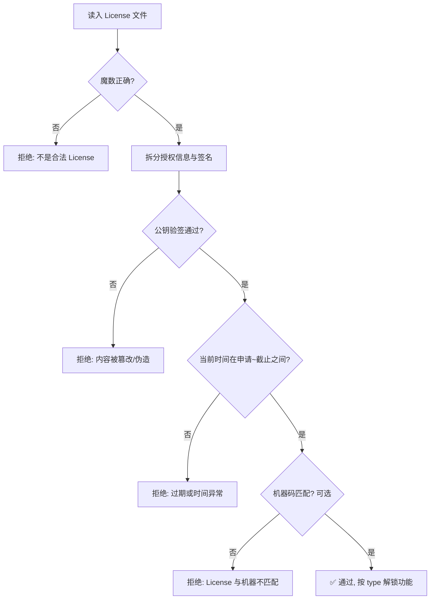
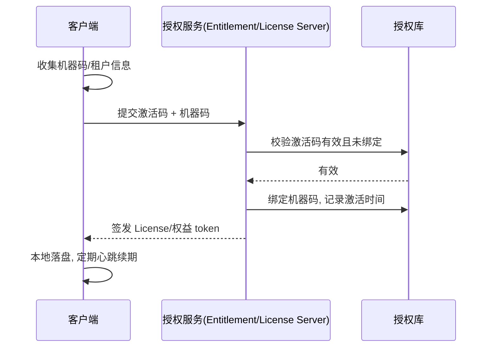

# License 授权详解

> 通用主题：不限于 Java / Python（跨语言设计，含离线 / 在线 / 微服务场景）
> 版本基线：2026-08 整理，覆盖 License 原理、机器码绑定、授权设计方案全景、离线在线完整实例、微服务通用方案
> 受众声明：面向需要给交付软件做商业授权（试用期 / 按功能收费 / 防白嫖）的开发者。默认已懂 RSA 非对称加密与数字签名概念、代码混淆基础（见 [01-代码混淆详解](01-代码混淆详解.md)）；License 文件结构、机器码获取、授权中心等本篇术语全讲。
> 关联笔记：[01-代码混淆详解](01-代码混淆详解.md)（混淆防「读懂代码」，License 防「白嫖使用」，两者组合成商业保护方案）、[00-软件保护总览](00-软件保护总览.md)

## 📋 总纲

1. License 是什么：定义、边界、与开源许可证的区别
2. 分类体系：离/在线、单机/浮动、永久/订阅
3. 核心原理：非对称签名 + License 文件结构
4. 机器码绑定：为什么绑、怎么取（Java/Python 实测）、边界
5. 授权设计方案全景：License 文件 / Key 激活码 / 在线账号 / 加密狗
6. 离线授权完整实例：Java（RSA 自研）/ Python（cryptography）
7. 在线授权与微服务通用方案：Entitlement 功能约束、授权中心、浮动授权、心跳续期、吊销
8. 防破解与边界：时间回拨、防共享、混淆联动
9. 最佳实践
10. 常见踩坑
11. 面试问答
12. 小结

## 学习目标

学完本篇你能：

1. 说清 License 的本质、四大特性，以及和「开源许可证」的区别（不混概念）
2. 按四维（离/在线、单机/浮动、永久/订阅、功能分级）给任意场景定授权方案，并在文件/Key/账号/加密狗四种形态中完成选型
3. 用 Java 或 Python 独立实现一套离线 License 的签发与校验（含机器码绑定、防篡改、防过期）
4. 防住常见破解手段：时间回拨、多机共享、patch 校验、换公钥重签
5. 设计微服务/云原生场景的 Entitlement 功能约束方案（功能 flag/配额/计量 + 授权中心 + JWT 传播）
6. 答好 License 相关面试题（签名原理、机器码、浮动授权、离线防篡改、微服务方案）

## 前置知识

- **已懂**：RSA 非对称加密与数字签名基本概念（哈希、公钥/私钥、验签）。若陌生，本篇 3.1 有完整讲解
- **建议先读**：[01-代码混淆详解](01-代码混淆详解.md)——混淆防「读懂代码」、License 防「白嫖使用」，两者常组合成商业保护方案（ToB 交付防转售/防竞对）
- 本篇术语全讲（License 文件结构、机器码、授权中心、Entitlement 功能约束等），无其他强制前置

## 1. License 是什么

**License（软件许可/授权许可）**：软件商签发给使用者的一张「使用凭证」，凭它软件才允许你使用——用来验证使用者身份、控制授权范围（单机/多机）、功能等级（基础版/专业版/企业版）和使用期限（永久/订阅/试用）。

**一句话记忆**：License 是**盖了厂商私钥印章的电子门票**——验票（公钥验签）通过才放行，印章（私钥）只有厂商有，伪造不了。

**License 的四大特性**（设计目标）：

| 特性 | 含义 | 对应手段 |
| --- | --- | --- |
| 保密性 | 授权信息不被轻易读出规律、防伪造 | 可选加密（RSA+AES 混合） |
| 防篡改 | 改有效期/功能/机器码会失效 | **签名**（核心） |
| 时效性 | 记录有效期并在校验时判断 | 申请时间 + 截止时间 |
| 可找回 | 客户丢 License 可凭源文件重新签发 | 签发侧保留源文件 |

### 1.1 与「开源许可证」的区别（名字撞车澄清）

「License」在软件圈有两个完全不同的含义，别混：

| 维度 | 开源许可证（Open Source License） | 商业授权（License Key/文件） |
| --- | --- | --- |
| 对象 | 代码的**使用/分发规则**（法律文本） | 软件的**使用许可凭证**（技术凭证） |
| 例子 | GPL / MIT / Apache-2.0 / BSD | 激活码、xxx.lic 文件、试用授权 |
| 本质 | 授权**别人怎么用你的代码** | 授权**客户能不能用你的软件** |
| 载体 | 随源码分发的 LICENSE 文件 | 加密/签名的数据文件或字符串 |
| 相关方 | 开源作者 ↔ 使用者 | 厂商签发 ↔ 客户激活 |

> 本篇全部讲**商业授权**（技术实现）；开源许可证的法律条款选择不在本篇范围。

### 1.2 边界认知（重要）

**License ≠ 安全**：和混淆一样，纯离线授权没有绝对安全——只要软件在你机器上运行，就存在被破解的可能（patch 掉校验逻辑、换公钥重签等）。License 的价值是**把破解成本抬到超过收益**。**最强的校验在服务端**（在线授权），离线方案再严密也只是提高门槛。

## 2. 分类体系

License 从四个维度分类，方案选型时四维都要定：

| 维度 | 分类 | 说明 | 典型场景 |
| --- | --- | --- | --- |
| 校验方式 | 离线授权 | 本机验签，不联网；签发与使用解耦 | ToB 交付、内网部署、军工/银行 |
| | 在线授权 | 服务端校验/心跳，可实时吊销 | SaaS、订阅制、防破解要求高 |
| 授权对象 | 单机授权（节点锁定） | License 绑定一台机器（机器码） | 桌面软件、单服务器 |
| | 浮动授权（Floating） | N 个席位共享，谁用谁 checkout | 工业软件（Ansys/CAD）、设计工具 |
| 期限 | 永久授权 | 无时间限制（仍可绑机器码） | 买断制 |
| | 订阅授权 | 到期续费，逾期停用 | SaaS 主流 |
| | 试用授权 | 限时/限功能，引导转化 | 新客试用 |
| 功能分级 | 基础/专业/企业版 | 同一软件按 License 解锁功能 | 商业化分级收费 |

## 3. 核心原理

### 3.1 非对称签名：私钥签发，公钥验签

License 防伪的根基是**数字签名**（非对称算法，RSA/ECDSA）：

- **签发**（厂商侧）：对授权信息先做哈希（SHA-256），再用**私钥**对摘要签名
- **校验**（客户端）：用**公钥**验签，通过则说明内容确实是私钥持有者签发的、且**未被篡改过一分一毫**

**类比**：演唱会门票人人能画（内容公开），但官方印章只有主办方有——验票就是验「印章」（签名），不是验「画工」（内容）。私钥 = 印章，公钥 = 验章模板。

**签名 ≠ 加密**（高频考点）：

| | 加密（Encryption） | 签名（Signature） |
| --- | --- | --- |
| 目的 | 保密：别人看不懂 | 防伪：别人改不了/伪造不了 |
| 密钥用法 | 公钥加密、私钥解密 | **私钥签名、公钥验签** |
| 结果 | 密文 | 原文 + 签名（原文通常仍可见） |
| 场景 | HTTPS 传输 | License、证书、软件发布 |

**为什么 License 用签名而不是加密？**
- 对称加密（AES）：密钥要内置在客户端 → 逆向提取密钥后**人人都能伪造 License**，方案直接崩
- 非对称加密：公钥能解密，等于授权信息公开，只解决「保密」不解决「防伪」
- 签名：私钥只留在厂商签发侧，客户端只有公钥（公钥被提取也没用，只能验不能签）——**验票逻辑天然适合公开**

### 3.2 License 文件结构

一个典型离线 License 文件（文本行版，本笔记实例用此格式）：

```
ROBINLIC                              ← 魔数：快速识别 + 格式校验
product=DemoApp                       ← 授权信息（明文可读，逐行 key=value）
user=robin
type=professional
issued=2026-08-10
expiry=2026-09-10
machine=DEMO-MAC-001
---SIG---
HB7u7E3HKCHKmN8+...                   ← 对上面全部授权信息的私钥签名（Base64）
```

| 字段 | 作用 | 必须签名？ |
| --- | --- | --- |
| 魔数 | 快速识别文件类型 + 格式校验（类比 class 文件的 CAFEBABE） | 否 |
| 申请时间 | 防「把时间改到签发之前」的漏洞依据 | **是** |
| 到期时间 | 有效期判断（防改日期白嫖） | **是** |
| 授权信息 | 用户/产品/功能/机器码/唯一 ID 等 | **是** |
| 签名 | 对授权信息 + 日期的完整性证明 | —— |

要点：
- **日期必须签名**：不签名的话客户把日期字段改了就能永久使用——签名把「改日期」变成「改签名」，而签名改不了
- **授权信息可以明文**：签名已保证不可篡改；但若携带敏感信息（如客户合同号），可选加密（见下折叠块）
- 二进制版结构同理：魔数 + 分隔符 + 各字段长度前缀 + 字段 + 签名（按长度读，如深信服文章所示）

> [!note]- 保密性增强：RSA+AES 混合加密（可选）
> 若授权信息含敏感数据：先用随机 AES 密钥加密授权信息，再用厂商 RSA **公钥**加密该 AES 密钥（数字信封）；客户端用内置 RSA **私钥**解出 AES 密钥再解密内容。注意：这里是加密场景（公钥加密私钥解密），与签名正好相反；客户端私钥被逆向提取是风险点，需配合代码混淆/加固（见 [01-代码混淆详解](01-代码混淆详解.md)）。

### 3.3 加载校验流程



## 4. 机器码绑定

### 4.1 为什么绑

License 文件本身不防**拷贝**——一份签名 License 拷到 100 台机器都能验签通过。绑机器码（节点锁定）让 License 只在**一台机器**上有效，防多机共享。

### 4.2 怎么取（Java / Python 实测）

| 语言 | 方案 | 说明 |
| --- | --- | --- |
| Java | 标准库 `NetworkInterface` 取 MAC | 简单，但 MAC 可被工具修改、虚拟机可克隆 |
| Java | **oshi**（三方库，推荐） | 跨平台取主板/磁盘/CPU 序列号，比 MAC 稳定得多 |
| Java | `Runtime.exec` 调系统命令 | dmidecode（Linux）/ wmic（Windows）/ system_profiler（macOS），解析麻烦 |
| Python | `uuid.getnode()` | 48 位 MAC 派生值，同样可伪造 |
| Python | `platform.node()` | 主机名，太容易撞 |
| Python | 系统命令取主板级 ID | macOS `ioreg` IOPlatformUUID / Linux `dmidecode -s system-serial-number` / Windows `wmic csproduct get uuid` |
| 通用 | 多因子组合 | 主板序列号 + 磁盘序列号 + MAC 做 hash，取其一不可用/被改也能容错 |

本机实测（macOS 15，Java 17.0.12 / Python cryptography 46.0.7，已打码）：

```bash
# Java：第一个非回环网卡的 MAC
llw0 MAC = DE06****3EE8

# Python：三个指标
uuid.getnode() = 0xacde****1122
platform.node() = MacBookPro
IOPlatformUUID = 3FC5****217B0C    ← 主板级，跨网卡更换不变，最可靠
```

### 4.3 边界与易错点

- **虚拟机克隆**：克隆出的 VM 机器码相同 → 一个 License 多 VM 用。生产上可在授权条款限制 + 检测虚拟化环境（oshi 可识别）
- **硬件更换**：客户换主板/网卡后 License 失效 → 需要**解绑/重签流程**（客服验证后重发）
- **MAC 可改**：macOS/Linux 可用工具改 MAC → 单靠 MAC 绑定防不住有心人，尽量用主板/磁盘序列号
- **无稳定序列号的平台**：部分 Windows 老机器 CPUID 不可读 → 取多因子 + 容错（缺一项仍可算）
- **机器码算法要稳定**：同一台机器每次算出的指纹必须一致（排序后再 hash，别依赖枚举顺序）

## 5. 授权设计方案全景

做授权方案先选「形态」，再谈加密细节。四种主流设计：

| 方案 | 原理 | 安全性 | 用户体验 | 离线可用 | 实现成本 | 典型场景 |
| --- | --- | --- | --- | --- | --- | --- |
| **License 文件** | 签名文件（本文实例） | 高（私钥签发） | 中（放文件/导入） | ✅ | 低 | ToB 交付、内网部署 |
| **Key 激活码** | 短码 + 在线兑换或本地验签 | 中~高 | 高（输入一串码） | 部分 | 低~中 | ToC 软件、试用转化 |
| **在线账号** | 账号登录 + 服务端校验 | 最高（可实时吊销） | 高（但必须联网） | ❌ | 高 | SaaS、订阅制 |
| **加密狗（硬件锁）** | USB 硬件内置密钥参与校验 | 最高（硬件不可复制） | 低（要插狗） | ✅ | 高（硬件成本） | 高价工业软件（CAD/EDA） |

### 5.1 Key 激活码设计（重点补充）

Key 授权是 ToC 最常见的形态，两种玩法：

**① 在线兑换型（推荐）**：激活码只是一串**随机短码**（如 `XK7M-9P2Q-4RTC-8HZW`），本身不含授权信息。流程：用户输入激活码 → 客户端请求授权服务 → 服务端查库校验码是否有效/未用 → 签发正式 License（文件或 token）→ 本地落盘。激活码可被吊销、可绑定账号/机器，安全性由**服务端**兜底。防穷举：激活码加校验位 + 服务端限流 + 连续失败锁定。

**② 离线签名型**：短码 = 机器码 + 授权信息压缩 + 私钥签名（Base32 编码，去掉易混字符 0/O、1/I）。客户端本地验签，不联网。但短码承载信息有限、无法吊销，适合低价值场景。

**选型建议**：能联网就选在线兑换（可控性强）；必须离线（内网/军工）选 License 文件；ToC 试用转付费选激活码+在线兑换；高价工业软件可上加密狗（加密狗本质是「把私钥藏进硬件」，校验逻辑与本文一致，只是签名操作在硬件内完成）。

## 6. 离线授权完整实例

> 两段代码均为**本机实测**（demo 在 /tmp/license-demo，重启自动清）：JDK 17.0.12 编译运行 / mamba base Python 3 + cryptography 46.0.7。核心逻辑 Java 与 Python 完全对齐（SHA256withRSA / PKCS1v1.5），可互相验签。

### 6.1 Java 实现（JDK 17，无外部依赖）

```java
import java.nio.charset.StandardCharsets;
import java.nio.file.*;
import java.security.*;
import java.time.LocalDate;
import java.util.Base64;

public class DemoLicense {
    static final String MAGIC = "ROBINLIC";           // 魔数：快速识别 + 格式校验
    static final String SIG_SEP = "\n---SIG---\n";    // 授权信息与签名之间的分隔

    public static void main(String[] args) throws Exception {
        Path dir = Path.of("/tmp/license-demo/keys");
        Files.createDirectories(dir);

        // 1. 生成 RSA 密钥对（生产只生成一次，私钥保存在厂商签发侧）
        KeyPair kp = genKeyPair();
        saveKey(dir.resolve("private.pem"), kp.getPrivate().getEncoded()); // PKCS8
        saveKey(dir.resolve("public.pem"), kp.getPublic().getEncoded());   // X509

        // 2. 签发 License：授权信息 + 私钥签名
        String license = "product=DemoApp\n" +
                "user=robin\n" +
                "type=professional\n" +
                "issued=" + LocalDate.now() + "\n" +
                "expiry=2026-09-10\n" +
                "machine=DEMO-MAC-001\n";
        String signature = sign(license, kp.getPrivate());
        String licenseFile = MAGIC + "\n" + license + SIG_SEP + signature;
        Files.writeString(Path.of("/tmp/license-demo/demo.lic"), licenseFile);

        // 3~5. 三种校验场景
        System.out.println("正常校验   valid=" + verify(licenseFile, kp.getPublic()));
        String tampered = licenseFile.replace("2026-09-10", "2099-12-31");
        System.out.println("篡改后校验 valid=" + verify(tampered, kp.getPublic()));
        System.out.println("过期校验   valid=" + verify(licenseFile, kp.getPublic(),
                LocalDate.parse("2027-01-01")));
    }

    /** 生成 2048 位 RSA 密钥对（生产建议 3072/4096） */
    static KeyPair genKeyPair() throws NoSuchAlgorithmException {
        KeyPairGenerator g = KeyPairGenerator.getInstance("RSA");
        g.initialize(2048);
        return g.generateKeyPair();
    }

    static void saveKey(Path p, byte[] der) throws Exception {
        String b64 = Base64.getEncoder().encodeToString(der);
        Files.writeString(p, "-----BEGIN KEY-----\n" + b64 + "\n-----END KEY-----\n");
    }

    /** 私钥签名：SHA256withRSA（先哈希再签名，标准做法） */
    static String sign(String data, PrivateKey key) throws Exception {
        Signature s = Signature.getInstance("SHA256withRSA");
        s.initSign(key);
        s.update(data.getBytes(StandardCharsets.UTF_8));
        return Base64.getEncoder().encodeToString(s.sign());
    }

    /** 校验 License：魔数 → 拆签名 → 验签 → 检查有效期 */
    static boolean verify(String licenseFile, PublicKey pubKey, LocalDate now) throws Exception {
        String[] parts = licenseFile.split("\n---SIG---\n", 2);
        if (parts.length != 2) return false;          // 结构损坏
        String[] head = parts[0].split("\n", 2);
        if (!MAGIC.equals(head[0])) return false;     // 魔数不对

        String content = head[1];
        // 1) 验签（防篡改核心）
        Signature s = Signature.getInstance("SHA256withRSA");
        s.initVerify(pubKey);
        s.update(content.getBytes(StandardCharsets.UTF_8));
        try {
            if (!s.verify(Base64.getDecoder().decode(parts[1].trim()))) return false;
        } catch (IllegalArgumentException e) {
            return false;                             // 签名不是合法 Base64
        }
        // 2) 有效期检查（时间被篡改的防御见 8）
        LocalDate expiry = null;
        for (String line : content.split("\n")) {
            if (line.startsWith("expiry=")) expiry = LocalDate.parse(line.substring(7));
        }
        return expiry != null && !now.isAfter(expiry);
    }
}
```

实测输出（JDK 17.0.12）：

```
正常校验   valid=true
篡改后校验 valid=false    ← 把 expiry 改成 2099，验签立刻失败
过期校验   valid=false    ← 校验时间推到 2027，有效期检查拦截
```

### 6.2 Python 实现（cryptography）

```python
"""License 离线授权最小可运行示例（cryptography 46.0.7）
演示：生成密钥对 -> 签发 License -> 校验（正常 / 篡改 / 过期）"""
import base64
from datetime import date
from pathlib import Path

from cryptography.hazmat.primitives import hashes, serialization
from cryptography.hazmat.primitives.asymmetric import rsa, padding

MAGIC = "ROBINLIC"


def gen_keypair(save_dir: Path):
    save_dir.mkdir(parents=True, exist_ok=True)
    private_key = rsa.generate_private_key(public_exponent=65537, key_size=2048)
    # 私钥 PKCS8 PEM（生产环境只留在签发侧）
    (save_dir / "private.pem").write_bytes(
        private_key.private_bytes(
            serialization.Encoding.PEM,
            serialization.PrivateFormat.PKCS8,
            serialization.NoEncryption(),
        )
    )
    # 公钥 X509 SubjectPublicKeyInfo PEM（随客户端分发，做校验用）
    (save_dir / "public.pem").write_bytes(
        private_key.public_key().public_bytes(
            serialization.Encoding.PEM,
            serialization.PublicFormat.SubjectPublicKeyInfo,
        )
    )
    return private_key


def sign_license(content: str, private_key) -> str:
    # SHA256 + PKCS1v1.5 签名（与 Java 的 SHA256withRSA 同一算法族，可互相验签）
    sig = private_key.sign(content.encode("utf-8"), padding.PKCS1v15(), hashes.SHA256())
    return base64.b64encode(sig).decode()


def verify_license(license_file: str, public_key) -> tuple[bool, str]:
    parts = license_file.split("\n---SIG---\n", 1)
    if len(parts) != 2:
        return False, "结构损坏"
    head = parts[0].split("\n", 1)
    if head[0] != MAGIC:
        return False, "魔数不对"
    content, sig_b64 = head[1], parts[1].strip()

    # 1) 验签（防篡改核心）
    try:
        public_key.verify(
            base64.b64decode(sig_b64),
            content.encode("utf-8"),
            padding.PKCS1v15(),
            hashes.SHA256(),
        )
    except Exception:
        return False, "验签失败（内容被篡改或签名非法）"

    # 2) 有效期检查
    expiry = None
    for line in content.split("\n"):
        if line.startswith("expiry="):
            expiry = date.fromisoformat(line[7:])
    if expiry is None:
        return False, "缺少有效期"
    if date.today() > expiry:
        return False, f"已过期（{expiry}）"
    return True, "有效"


if __name__ == "__main__":
    d = Path("/tmp/license-demo/py")
    priv = gen_keypair(d)

    content = "\n".join([
        "product=DemoApp", "user=robin", "type=professional",
        f"issued={date.today()}", "expiry=2026-09-10", "machine=DEMO-MAC-001",
    ])
    lic = f"{MAGIC}\n{content}\n---SIG---\n{sign_license(content, priv)}"
    (d / "demo.lic").write_text(lic)

    pub = serialization.load_pem_public_key((d / "public.pem").read_bytes())
    print("== 1. 正常校验 ==", verify_license(lic, pub))

    tampered = lic.replace("2026-09-10", "2099-12-31")
    print("== 2. 篡改后校验 ==", verify_license(tampered, pub))

    expired_content = content.replace("2026-09-10", "2020-01-01")
    expired_lic = f"{MAGIC}\n{expired_content}\n---SIG---\n{sign_license(expired_content, priv)}"
    print("== 3. 过期校验 ==", verify_license(expired_lic, pub))
```

实测输出（cryptography 46.0.7）：

```
== 1. 正常校验 == (True, '有效')
== 2. 篡改后校验 == (False, '验签失败（内容被篡改或签名非法）')
== 3. 过期校验 == (False, '已过期（2020-01-01）')
```

> [!note]- 工业级方案：TrueLicense 简介
> Java 生态经典开源方案 **TrueLicense**（de.schlichtherle）做了上面所有事的工程化：① `keytool` 生成密钥对存入 **KeyStore**（证书库）② `LicenseManager` 抽象了签发/安装/校验 ③ 支持自定义校验（机器码、额外属性）④ License 本身是签名的二进制文件。
> 常规流程：keytool 生成密钥对 → 导入 KeyStore → 自定义 `LicenseManager`（校验机器码/其他）→ 厂商用私钥签发 `.lic` → 客户端用公钥安装校验。自己写轮子（本文实例）适合学习/轻量场景；生产 ToB 建议直接基于 TrueLicense 或同类方案，省掉 KeyStore/格式/异常处理的坑。相关文章众多（CSDN/博客园/知乎均有实操），选型时注意其开源协议与维护活跃度。

## 7. 在线授权与微服务通用方案

### 7.1 在线激活流程（Key/账号通用）



### 7.2 传统 License 文件方案在微服务/云原生场景的局限（重要）

- **机器码绑定失效**：微服务实例动态扩缩容、容器/IP 漂移，没有「固定一台机器」的概念——每扩一个 Pod 就要一个新 License 显然不现实
- **文件分发不现实**：几十上百个服务，不可能每个都内置一份 License 文件做本地验签
- **授权粒度错位**：传统 License 按「软件副本/机器」授权；微服务需要的是按「**租户/功能/用量**」授权——粒度完全不同
- **结论**：离线文件方案是**单机软件 / ToB 私有化交付**的解法，不是微服务场景的解法；微服务/云原生要走「功能约束」

### 7.3 现代方案：Entitlement 功能约束（市面主流）

**定义**：Entitlement（权益/功能约束）不回答「这软件能不能用」，而是回答「这个租户/用户**能用哪些功能、能用多少**」——授权服务把客户买的东西翻译成一组可实时执行的「权益」，各服务按权益放行。

**一句话记忆**：License 记录**卖了什么**（合同），Entitlement 实时执行**能用什么**（门禁）——Schematic 原话："licensing documents what was sold, while entitlements enforce what customers can use in real time"。

**三大约束维度**：

| 维度 | 约束什么 | 典型例子 | 实现载体 |
| --- | --- | --- | --- |
| 功能约束（feature gating） | 能用哪些模块/功能 | 基础版无报表模块，企业版解锁 | **Feature Flag**（开关矩阵） |
| 配额约束（quota） | 能用多少 | 用户数 50、并发 10、节点 3、API 10 万次/月 | Redis 计数 / 额度账户 |
| 计量（metering） | 按实际用量 | 调用次数、处理数据量、存储量 | 用量打点 + 计费系统 |

**与传统 License 对比**：

| 维度 | 传统 License | Entitlement 功能约束 |
| --- | --- | --- |
| 授权单位 | 机器/软件副本 | **租户/用户/功能/配额** |
| 载体 | 签名文件/激活码 | 授权服务（API 驱动） |
| 校验时机 | 启动时一次（离线） | 实时/定期同步（在线） |
| 调整灵活性 | 重新签发文件 | **改库即时生效**（升级/降级/吊销） |
| 离线支持 | ✅ 强 | ❌ 弱（需宽限期） |
| 适用场景 | 单机软件、私有化交付 | 微服务、SaaS、多租户 |

**业界案例**（都是「按什么授权」的典型）：

| 产品 | 授权模型 |
| --- | --- |
| GitLab EE | 按**用户数** + 功能模块（免费/专业/旗舰版 feature 开关） |
| Confluent / MongoDB Enterprise | 按**集群节点数**（节点增减即调整授权） |
| JetBrains / Atlassian | 按**用户/席位** |
| OpenAI / Stripe / 云厂商 | 按**用量计量**（token/调用量/存储） |

**关键设计**：
- **功能约束的载体是 Feature Flag**：授权服务下发「该租户开启哪些 flag」的矩阵（JWT claims 或定期拉取），各服务按 flag 放行——把「授权」与「代码开关」解耦，业务代码里没有 License 概念
- **配额是硬约束**：Redis 原子计数防超用，超配额返回 429/拒绝，配合审计日志
- **多租户隔离**：entitlement 按 tenant 维度下发，租户间互不泄漏

### 7.4 授权中心（License/Entitlement Server）微服务设计

微服务/分布式场景下，授权从「单机校验」升级为「集中式授权中心」（同时管 License 与 Entitlement），核心组件：

| 组件 | 职责 | 关键点 |
| --- | --- | --- |
| **授权服务** | 签发/校验/续期/吊销 + **entitlement 权益下发** | 独立部署，不跟业务服务耦合；私钥只在它手里 |
| **授权库** | 激活码、授权记录、**租户权益矩阵**、吊销列表、心跳时间 | 落库才可追溯、可吊销；Redis 做热数据 |
| **客户端 SDK** | 嵌入各业务服务，缓存授权结果（含 feature flag 矩阵） | 校验失败降级策略（宽限期） |
| **心跳** | 客户端定期上报，证明「还在用」；顺带同步最新权益 | 心跳过期 → 进入宽限期（如 7 天）→ 停用 |
| **吊销列表** | 违约客户的黑名单 | 心跳时检查，或客户端定期拉取 |

**微服务「通用方案」要点**：

- **多实例一致性**：授权服务多副本部署时，激活码兑换/浮动席位/配额计数用 **Redis 原子操作**（`INCR`/分布式锁）防超卖超用；授权记录最终落库，Redis 只做并发控制
- **授权上下文传播**：网关/授权服务校验通过后签发 **JWT**（含租户、功能 flag、配额、过期时间），业务服务只验签 JWT 不再重复查库——与「网关鉴权」模式一致，这也是 feature gating 的标准落地姿势
- **缓存与降级**：业务服务把授权结果/flag 矩阵缓存本地（如 5 分钟），授权服务短暂不可用不闪断业务；长期不可用走宽限期
- **版本兼容**：License/权益带 `version` 字段，升级授权格式时老数据仍可识别（服务端校验最灵活）
- **灰度**：授权服务先灰度 10% 流量，观察心跳成功率再放量；吊销/续期/改权益操作要审计日志

### 7.5 浮动授权（Floating License）

**原理**：中心 License Server 存 N 个「席位」（并发数）。用户启动软件时向服务器 **checkout** 借一个席位（记录谁借了、借多久），关闭时 **checkin** 归还；N 个席位借完，第 N+1 个用户被拒或排队。客户买的是「并发数」，不是「用户数」——2000 人公司买 50 席，同时只有 50 人能用。本质上浮动授权就是「**并发配额**」这一维 entitlement，可并入上面的配额约束统一管理。

**实现要点**：
- 席位状态放 Redis（`SET` 用户→超时时间 + 原子计数），防重启丢失
- **超时自动释放**：客户端异常退出（断电/崩溃）没 checkin → 席位按租约时间（lease）自动过期回收，避免席位被死占
- 心跳续租：客户端定期续租，断网超时即释放席位（与分布式锁的看门狗同理）
- 工业软件标配（Ansys、CAD/EDA 系），商业方案：LicenseSpring、Thales Sentinel、Revenera FlexNet——自研只适合轻量内部场景

## 8. 防破解与边界

「没有万无一失的防破解，只有破解成本高不高」——按攻击方式逐个设防：

| 攻击方式 | 手段 | 防御 |
| --- | --- | --- |
| 篡改日期白嫖 | 改系统时间 / 改 License 日期字段 | 日期字段签名（改即失效）+ 时间回拨检测（见下） |
| patch 校验逻辑 | 反编译后让校验恒返回 true | 代码混淆/加固（联动 [01-代码混淆详解](01-代码混淆详解.md)）+ 完整性自校验 |
| 换公钥重签 | 提取客户端公钥替换成自己的，用自己私钥重签 | 公钥与校验逻辑绑定（哈希校验公钥、分散存放）、服务端校验兜底 |
| 多机共享 | 一份 License 拷多台 | 机器码绑定（节点锁定） |
| 穷举激活码 | 暴力试短码 | 校验位 + 服务端限流 + 连续失败锁定 |
| 提取对称密钥 | 逆向 AES 密钥伪造 | 别用对称密钥做签发；用非对称签名 |

**时间回拨检测（离线场景重点）**：
- 校验条件：`申请时间 <= 当前系统时间 <= 截止时间`——把系统时间改到申请时间之前同样违规
- **记录上次成功时间**：首次激活把「上次时间」加密存本地，每次校验比较「当前时间 >= 上次时间」，否则判定时间被回拨；备份/恢复时间文件的攻击可把记录存到**数据库**（数据库所在机器与软件分离）或结合在线对表
- **在线对表最稳**：能联网就和服务端时间比对，客户端时间只做兜底

**给破解者算笔账**：破解成本 = 逆向难度（混淆）+ 时间漏洞封堵 + 服务端校验；目标只是让「破解成本 > 软件售价」就够了。

## 9. 最佳实践

- **私钥永不落客户端**：签发只发生在厂商侧（或授权服务），客户端只有公钥；私钥泄露 = 全线崩溃
- **每客户独立 License**：带唯一 ID + 客户标识，才能单点吊销、出问题好排查
- **License 加版本号**：授权格式演进（加字段/换算法）时旧 License 仍可识别
- **机器码多因子 + 容错**：主板/磁盘/MAC 组合 hash，缺一项仍能算出稳定指纹
- **能联网就加心跳**：离线宽限期（grace period）设计好，兼顾「防闪断」与「防长期失联」
- **日志脱敏**：License 校验日志别打印完整签名/机器码，防日志泄露后定向伪造
- **合规先行**：试用→付费、解绑/重签、退款停用等业务流程在技术方案之前定清楚

## 10. 常见踩坑

- **用对称密钥签发**：客户端内置 AES 密钥被逆向提取 → License 可被任意伪造（本系列最高频错误）
- **日期字段不签名**：客户改日期白嫖，签名形同虚设
- **机器码不稳定**：枚举顺序依赖（网卡列表顺序变化）→ 同一台机器指纹漂移，误杀正版客户
- **只验签不查有效期**：签名过了但 License 早就过期，等于永久授权
- **公钥硬编码被换**：客户端公钥不校验来源，攻击者换自己的公钥 + 重签文件即可绕过
- **验证逻辑不混淆**：Java 反编译后 patch 掉校验分支，离线方案直接报废
- **浮动授权席位不设超时**：客户端崩溃后席位永久占用，并发数慢慢归零
- **吊销只做客户端判断**：吊销列表不强制（客户端可跳过拉取），服务端校验才能真吊销

## 11. 面试问答

### 11.1 为什么 License 校验用非对称签名而不是对称加密？
对称加密密钥要内置客户端，逆向提取后人人可伪造 License；非对称签名私钥只在厂商侧，客户端只有公钥（只能验不能签），天然适合「验票逻辑公开」的场景。签名保证的是防篡改/防伪造，加密保证的是保密，两者目的不同。

### 11.2 离线授权怎么防止用户篡改系统时间？
校验条件收紧为「申请时间 ≤ 当前 ≤ 截止时间」，并把上次成功校验的时间加密落盘，每次校验比较「当前 ≥ 上次」，发现回拨即拒绝；更稳的是记录存到数据库（与软件分机）或在线与服务端时间对表。

### 11.3 机器码怎么取？单点硬件序列号可靠吗？
跨平台方案：Java 用 oshi 库、Python 用系统命令（macOS ioreg IOPlatformUUID / Linux dmidecode / Windows wmic）+ `uuid.getnode()` 兜底。单点不可靠——MAC 可改、虚拟机可克隆、部分机器无序列号，所以要多因子组合 + 容错，并配套解绑/重签流程。

### 11.4 浮动授权和单机授权什么区别？并发数怎么控制？
单机授权把 License 锁死在一台机器；浮动授权是 N 个席位共享，用户 checkout 借用、checkin 归还。并发控制用 Redis 原子计数 + 租约超时自动释放（防客户端崩溃占死席位），心跳续租。

### 11.5 在线授权和离线授权怎么选？
能联网、防破解要求高选在线（服务端校验 + 实时吊销 + 心跳）；必须离线（内网/军工/外场）选离线签名方案。可混合：平时在线心跳、断网进宽限期，兼顾体验与管控。

### 11.6 微服务/云原生场景为什么不用 License 文件？市面上怎么做？
传统 License 文件 + 机器码绑定在微服务场景三处失效：实例动态扩缩容没有固定机器、文件分发不现实、授权粒度（按机器）与需求（按租户/功能/用量）错位。市面主流是 **Entitlement 功能约束**——License 记录"卖了什么"，Entitlement 实时执行"能用什么"：功能约束（feature flag 解锁模块）、配额约束（用户数/并发/节点/调用量）、计量（按量计费），由授权服务统一管理、JWT 下发权益、改库即时生效。

### 11.7 License 和开源许可证是一个东西吗？
不是。开源许可证（GPL/MIT/Apache-2.0）是规定代码使用/分发规则的法律文本；商业授权 License 是厂商签发的使用凭证（激活码/授权文件），本篇讲的是后者。

## 12. 小结

- License 本质 = **私钥签发的电子门票**：非对称签名防伪防篡改，私钥在厂商、公钥在客户端
- 四维分类定方案：离/在线 × 单机/浮动 × 永久/订阅 × 功能分级
- 机器码绑定防拷贝，但要点是**多因子 + 稳定 + 容错**
- 四种形态按场景选：License 文件（ToB 离线）/ Key 激活码（ToC）/ 在线账号（SaaS）/ 加密狗（高价工业软件）
- 微服务/云原生不走 License 文件：**Entitlement 功能约束**（功能 flag/配额/计量）+ 授权中心 + 心跳宽限 + Redis 并发控制 + JWT 传播，在线校验才是安全上限
- 没有绝对安全：时间回拨、patch 校验、换公钥都要防，目标是把破解成本抬过售价

## 上一篇 / 下一篇

- 上一篇：[01-代码混淆详解](01-代码混淆详解.md)（混淆与 License 组合成商业保护方案）
- 下一篇：加壳/反调试/完整性校验（📌 待补充，见 [00-软件保护总览](00-软件保护总览.md) 模块规划）

## 参考资料

- [一种基于RSA+AES算法实现的软件授权License设计思路（知乎）](https://zhuanlan.zhihu.com/p/187585495)，查询日期：2026-08-10
- [软件License授权原理（深信服社区，License 结构/防破解/时间回拨）](https://bbs.sangfor.com.cn/forum.php?mod=viewthread&tid=276263)，查询日期：2026-08-10
- [TrueLicense 实现 Java 工程 License 授权机制（CSDN 实操）](https://blog.csdn.net/cx1050306424/article/details/157246756)，查询日期：2026-08-10
- [Signed license key verification with RSA public key in Python（Stack Overflow）](https://stackoverflow.com/questions/54891500/signed-license-key-verification-with-rsa-public-key-in-python)，查询日期：2026-08-10
- [Floating License 原理（Thales CPL）](https://cpl.thalesgroup.com/software-monetization/floating-software-license)，查询日期：2026-08-10
- [Software Entitlements: What They Are and How to Use Them（Schematic，License vs Entitlement）](https://schematichq.com/blog/software-entitlements)，查询日期：2026-08-10
- [The Role of Licensing and Entitlements in SaaS and Multi-Tenant Apps（Slascone）](https://slascone.com/multi-tenant-licensing/)，查询日期：2026-08-10
- [The Dummies Guide to Software Entitlement Management（Nalpeiron）](https://nalpeiron.com/blog/dummies-guide-to-software-entitlement-management/)，查询日期：2026-08-10
- 实测数据：JDK 17.0.12（Java demo）+ mamba base Python 3、cryptography 46.0.7（Python demo），本机编译运行（demo 在 /tmp/license-demo，重启自动清）
